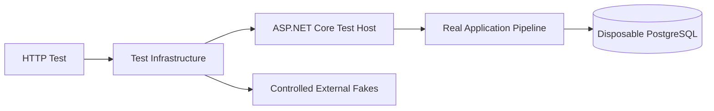

# PCL API Integration Tests

This project follows **ASP.NET Core functional integration testing with the Test Host pattern**. Tests call the API over HTTP through an in-process host, while important infrastructure such as PostgreSQL remains real.

The approach is adapted for this modular monolith: expensive resources are shared for speed, application data is reset before every test, and nondeterministic external boundaries are replaced with controlled test doubles.

## Architectural style

### Functional integration testing

Functional integration tests exercise a complete application use case through its public interface. In this project, that interface is HTTP.

A request passes through the real ASP.NET Core endpoint, serialization, validation, application, domain, and persistence layers. Tests therefore verify that these parts work together rather than testing one class in isolation.

Within the **Testing Pyramid**, this suite belongs to the integration layer:

- Broader and slower than unit tests because it crosses process-internal boundaries and uses PostgreSQL.
- Narrower and faster than end-to-end tests because the API runs in-process and external providers are not contacted.

注意: These tests complement unit and end-to-end tests; they do not replace either level.

### Test Host pattern

ASP.NET Core's `WebApplicationFactory<Program>` creates an in-process **test host** for the real application. The host exposes an `HttpClient`, so tests use normal HTTP requests without managing a separate API process or port.

This pattern provides high fidelity while allowing test-specific configuration and dependency replacement. The production request pipeline remains the system under test.



### Real infrastructure with controlled boundaries

Integration tests are most valuable when important technical boundaries remain real. This suite uses a disposable PostgreSQL container, applies the real EF Core migrations, and performs database operations through the application.

External or asynchronous dependencies may be replaced when using the real provider would make tests slow, unsafe, or nondeterministic. These replacements are **fakes**, not mocks of internal business behavior. For example, the current 実装 replaces Amazon S3 verification and event publication while keeping the database and HTTP pipeline real.

### Shared Fixture pattern

Starting an application host and database for every test is expensive. The **Shared Fixture pattern** creates them once for an xUnit test collection and disposes them after the collection finishes.

Shared infrastructure must not imply shared scenario state. Respawn clears application tables before every test while preserving migration history. Test parallelism is disabled because the suite currently shares one database and mutable test doubles.

重要: Every test must create its own prerequisites and remain independent of execution order.

### Test Infrastructure layer

Test-host creation, container lifetime, database reset, dependency replacement, and shared assertions form a small **test infrastructure layer**. Feature tests depend on this layer so they can focus on observable API behavior.

The boundary is intentional:

- Infrastructure code manages the test environment.
- Feature tests arrange data, send HTTP requests, and assert responses.
- Production code is exercised through public routes rather than test-only endpoints.

### Test Data Builder pattern

Request data uses the **Test Data Builder pattern**, adapted here as static factory methods with valid defaults. A test overrides only the values relevant to its scenario.

This keeps setup concise and makes invalid input deliberate. It is not currently a fluent builder API; `TestDataBuilder` is a lightweight variation of the pattern.

例: a lifecycle test can request a valid draft-task body, changing only its owner or timestamp.

## How this project applies the architecture

The conceptual roles map to the current 構成 as follows:

| Architectural role | Project implementation |
|---|---|
| HTTP test runner | xUnit v3 facts and theories |
| Test host | `PclApiFactory` based on `WebApplicationFactory<Program>` |
| Shared fixture | `IntegrationTestCollection` and `IntegrationTestFixture` |
| Per-test isolation | `IntegrationTestBase` invokes Respawn before each test |
| Real infrastructure | PostgreSQL 17 through Testcontainers and real EF Core migrations |
| Controlled boundaries | `TestEventBus` and `FakeS3StorageProfileVerifier` |
| Test data | `TestDataBuilder` request factories |
| Contract assertions | Typed response models, xUnit assertions, and `ProblemDetailsAssertions` |

Feature tests are grouped by capability and behavior. `Foundation` verifies the test environment itself; `TaskPlanning`, `Session`, and `Evidence` contain capability-focused query, lifecycle, assignment, and evidence-item scenarios. New capabilities should follow the same feature-oriented organization.

Current automated milestones:

- Milestone 1: shared test foundation and isolation smoke tests.
- Milestone 2: all 12 Task Planning endpoints.
- Milestone 3: all 6 Session endpoints, including task-assignment rules.
- Milestone 4: all 3 Evidence Item endpoints, including soft removal.

注意: Outbox-driven cross-module state changes remain part of Milestone 6. Session assignment tests assert the Session's HTTP contract without waiting for Task activation.

## Adding an integration test

1. Add the test under a feature folder and derive its class from `IntegrationTestBase`.
2. Arrange unique scenario data. Prefer public HTTP endpoints for prerequisites.
3. Act through `Client` using the real API route.
4. Assert the HTTP status and the meaningful response contract or externally visible state.
5. Add reusable valid request data to `TestDataBuilder`; keep invalid values in the test that explains them.
6. Add test-owned response models when strongly typed deserialization improves clarity.

Direct database setup is reserved for states that public HTTP cannot create. For example, the Session suite seeds two Active Sessions for one owner only to exercise the otherwise unreachable cross-session assignment guard.

Recommended conventions:

- Use `[Fact]` for one scenario and `[Theory]` for the same behavior across equivalent inputs.
- Follow Arrange–Act–Assert through clear statement ordering.
- Assert behavior, not private implementation details.
- Use `ProblemDetailsAssertions` for API error contracts.
- Pass `TestContext.Current.CancellationToken` to asynchronous HTTP operations.
- Do not manually clean the database or rely on another test's output.
- Reset configurable fake state if a test changes it. 現在, database reset clears `TestEventBus`, but does not reset `FakeS3StorageProfileVerifier.ShouldSucceed`.

## Running the suite

### Prerequisites

- .NET 9 SDK
- Docker Desktop or another Docker-compatible engine

No manually configured PostgreSQL instance is required. Testcontainers creates and removes the database container.

From `be/PCL_API`:

```powershell
dotnet test ..\PCL_API.IntegrationTests\PCL_API.IntegrationTests.csproj
```

Or run the complete solution:

```powershell
dotnet test PCL_API.sln
```

If the fixture reports `DockerUnavailableException`, confirm that Docker is running and accessible, then try again. 確認してください.
