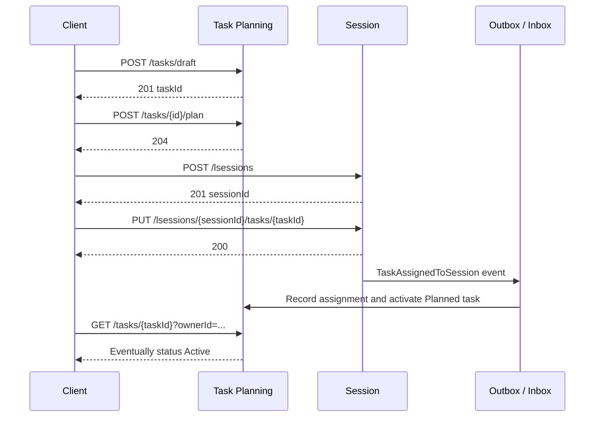

# Current System Flows

These flows describe behavior implemented today, including asynchronous module reactions.

## Flow 1: Plan work and execute it in a Session



Manual checks:

1. Draft task begins with status `"Draft"`.
2. Plan changes it to `"Planned"`.
3. Assigning it adds the ID to `assignedTaskIds`.
4. After background processing, the task becomes `"Active"`.
5. A Draft, Completed, or Cancelled task cannot be newly assigned.
6. The same task cannot be assigned to two Active sessions.

## Flow 2: Capture Evidence during execution

1. Start an Active Session.
2. Add Note evidence.
3. Add Link evidence.
4. List evidence with `includeRemoved=false`.
5. Remove one item with a reason.
6. List normally; removed item is absent.
7. List with `includeRemoved=true`; removed metadata is present.
8. End the Session.
9. Attempt to add evidence; expect `409 SessionEvidenceAttachmentEligibility.NotActive`.

The implementation allows removing already-existing evidence after the Session ends.

## Flow 3: Complete work

1. Complete the Planned or Active Task.
2. End the Active Session separately.
3. Read both resources.
4. Verify task status is Completed and Session status is Stopped.

Neither action triggers the other. This separation is intentional:

```text
Task = whether the intended outcome was satisfied
Session = whether the execution period ended
```

## Flow 4: Defer unfinished work

1. Assign a Planned task to a Session and wait until it becomes Active.
2. Remove it from the Active Session.
3. Call `POST /tasks/{taskId}/defer`.
4. Verify the task returns to Planned and appears in `/tasks/assignable`.

Removing a task from a Session does not currently defer it automatically.

## Flow 5: Configure local evidence storage

1. Add an allowed root in `EvidenceStorage:Local:AllowedRootDirectories`.
2. Create a Local profile under that root.
3. List profiles and copy the returned ID.
4. Test the profile.
5. Select it as active.
6. Get settings and verify it is returned as `activeProfile`.

Creation and selection both verify storage access. A path outside allowed roots must fail.

## Flow 6: Configure Amazon S3 storage

1. Run the API with an AWS identity that can inspect the target bucket.
2. Create an S3 profile with bucket, region, and optional prefix.
3. Test it.
4. Select it.
5. Verify settings.

The request never carries AWS credentials. Connectivity depends on the API process identity/environment.

## Cross-module consistency timing

Task assignment crosses module boundaries asynchronously:

```text
Session transaction
  -> Session outbox
  -> event bus
  -> Task Planning inbox
  -> inbox processor
  -> task activation
```

The development configuration runs outbox/inbox processing every 30 seconds. During manual testing, allow more than one interval before treating a missing Task status update as failure.
