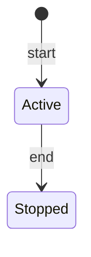

# Session API

## Purpose

Session owns bounded execution. Starting a session immediately creates it as Active; ending it makes it Stopped. A stopped session cannot accept task or evidence changes.

The current read endpoints are not owner-filtered, and no authentication is enforced.

## Endpoint catalog

| Method | Route | Purpose | Success |
| :--- | :--- | :--- | :--- |
| POST | `/lsessions` | Start an Active learning session | `201`, session ID |
| GET | `/lsessions` | List all sessions | `200`, array |
| GET | `/lsessions/{id}` | Get one session | `200`, session |
| PUT | `/lsessions/{id}/tasks/{taskId}` | Assign an eligible task | `200` |
| DELETE | `/lsessions/{id}/tasks/{taskId}` | Remove an assignment | `204` |
| PUT | `/lsessions/{id}/end` | Active → Stopped | `200` |

## Session representation

```json
{
  "id": "22222222-2222-2222-2222-222222222222",
  "ownerId": "11111111-1111-1111-1111-111111111111",
  "code": 1,
  "title": "API documentation session",
  "startedAt": "2026-06-24T14:00:00Z",
  "endedAt": null,
  "status": 0,
  "assignedTaskIds": []
}
```

Status values are `0` Active and `1` Stopped.

## Contracts

### Start session

`POST /lsessions`

```json
{
  "id": null,
  "ownerId": "11111111-1111-1111-1111-111111111111",
  "title": "API documentation session",
  "startedAt": "2026-06-24T14:00:00Z"
}
```

- `id` is accepted by the request contract but ignored by the current domain factory; the server generates the ID.
- `ownerId`, `title`, and `startedAt` are required.
- Only one Active session is allowed per owner.
- The `Location` header currently says `/api/lsessions/{id}`, although the working route is `/lsessions/{id}`.

### List and get

- `GET /lsessions` returns all sessions; there is currently no owner query parameter.
- `GET /lsessions/{id}` returns one session or `LSession.NotFound`.
- Assigned task IDs are included.

### Assign task

`PUT /lsessions/{id}/tasks/{taskId}`

```json
{
  "assignedAt": null
}
```

Rules:

- Session must exist and be Active.
- Task must exist, belong to the same owner as the session, and be Planned or Active.
- The same task cannot be assigned twice to one session.
- A task cannot be assigned to another Active session.
- `assignedAt` defaults to server UTC.
- A successful assignment emits an integration event. A Planned task is later activated by Task Planning through the outbox/inbox flow.

### Remove task

`DELETE /lsessions/{id}/tasks/{taskId}`

- Session must exist and be Active.
- Removing a task that is not assigned is idempotent and still succeeds.
- The current flow emits a removal integration event, but Task Planning has no corresponding handler that automatically defers the task.

### End session

`PUT /lsessions/{id}/end`

```json
{
  "endedAt": "2026-06-24T15:00:00Z"
}
```

- `endedAt` is required and cannot be before `startedAt`.
- Ending twice returns `LSession.AlreadyEnded`.
- Ending a session does not complete its assigned tasks.

## Lifecycle



| Operation | Active | Stopped |
| :--- | :---: | :---: |
| Assign/remove task | Yes | No |
| Add/remove evidence | Yes | Add: No; remove: currently allowed |
| End | Yes | No |
| Read | Yes | Yes |

The Evidence removal behavior above reflects code: removal checks evidence ownership and identity but does not check current Session state.

## Main error codes

| Code | Status | Meaning |
| :--- | ---: | :--- |
| `LSession.NotFound` | 404 | Session does not exist |
| `LSession.ActiveSessionAlreadyExists` | 409 | Owner already has an Active session |
| `LSession.InvalidOwnerId` | 400 | Empty owner ID |
| `LSession.InvalidTitle` | 400 | Missing title |
| `LSession.InvalidEndTime` | 400 | End predates start |
| `LSession.AlreadyEnded` | 400 | Session was already stopped |
| `LSession.NotActive` | 400 | Assignment mutation attempted on Stopped session |
| `LSession.TaskAlreadyAssigned` | 409 | Duplicate assignment |
| `LSession.TaskAlreadyAssignedToAnotherActiveSession` | 409 | Task is in another Active session |
| `TaskAssignmentEligibility.TaskNotFound` | 404 | Task missing |
| `TaskAssignmentEligibility.OwnerMismatch` | 409 | Task and session owners differ |
| `TaskAssignmentEligibility.NotAssignable` | 409 | Task is not Planned or Active |

