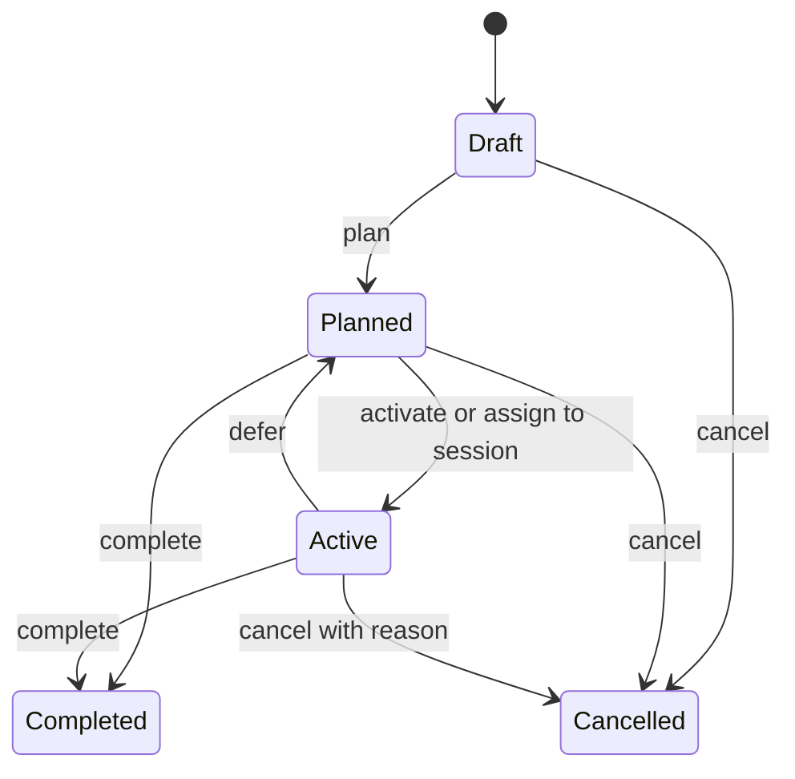

# Task Planning API

## Purpose

Task Planning owns intent: drafting, refining, organizing, and transitioning tasks. A task does not prove that work occurred; Session owns execution.

All routes are currently public. `ownerId` acts as the ownership boundary. Mutation and single-task queries return `404` when the task does not exist **or belongs to another owner**.

## Enumerations

| Type | Values |
| :--- | :--- |
| `TaskStatus` | `0` Draft, `1` Planned, `2` Active, `3` Completed, `4` Cancelled |
| `TaskCategory` | `0` Reading, `1` Coding, `2` Debugging, `3` Practice, `4` Review, `5` Research, `6` Writing |
| `TaskPriority` | `0` Low, `1` Medium, `2` High |

## Endpoint catalog

| Method | Route | Purpose | Success |
| :--- | :--- | :--- | :--- |
| POST | `/tasks/draft` | Capture a task in Draft state | `201`, task ID |
| GET | `/tasks` | List owner tasks with optional filters | `200`, array |
| GET | `/tasks/assignable` | List Planned tasks eligible for session assignment | `200`, array |
| GET | `/tasks/{taskId}` | Get one owner task | `200`, detail |
| PUT | `/tasks/{taskId}/details` | Refine title and description | `204` |
| PUT | `/tasks/{taskId}/category` | Set category | `204` |
| PUT | `/tasks/{taskId}/priority` | Set priority | `204` |
| POST | `/tasks/{taskId}/plan` | Draft → Planned | `204` |
| POST | `/tasks/{taskId}/activate` | Planned → Active | `204` |
| POST | `/tasks/{taskId}/defer` | Active → Planned | `204` |
| POST | `/tasks/{taskId}/complete` | Planned/Active → Completed | `204` |
| POST | `/tasks/{taskId}/cancel` | Draft/Planned/Active → Cancelled | `204` |

## Contracts

### Draft task

`POST /tasks/draft`

```json
{
  "ownerId": "11111111-1111-1111-1111-111111111111",
  "title": "Document the API",
  "description": "Build a manual testable endpoint catalog",
  "createdAt": "2026-06-24T14:00:00Z"
}
```

- `ownerId`: required, non-empty UUID.
- `title`: required, maximum 200 characters.
- `description`: optional, maximum 4000 characters.
- `createdAt`: optional; server UTC time is used when omitted.
- Returns the new UUID as a JSON string.
- The `Location` header currently says `/api/tasks/{id}`, although the working GET route is `/tasks/{id}`.

### List tasks

`GET /tasks?ownerId={ownerId}&status={status}&category={category}&priority={priority}&search={text}&createdFrom={timestamp}&createdTo={timestamp}`

- `ownerId` is required.
- Every other query parameter is optional.
- Filters are combined.
- Returns summaries ordered by the query implementation.

### List assignable tasks

`GET /tasks/assignable?ownerId={ownerId}`

Returns the owner's Planned tasks. Draft, Active, Completed, and Cancelled tasks are excluded.

### Get task

`GET /tasks/{taskId}?ownerId={ownerId}`

Returns task detail, including lifecycle timestamps. Session assignment IDs are not included in this response.

### Refine task

`PUT /tasks/{taskId}/details`

```json
{
  "ownerId": "11111111-1111-1111-1111-111111111111",
  "title": "Document and manually verify the API",
  "description": "Keep contracts aligned with implementation",
  "updatedAt": null
}
```

Allowed for Draft, Planned, and Active tasks. Terminal tasks return `Task.AlreadyTerminal`.

### Categorize task

`PUT /tasks/{taskId}/category`

```json
{
  "ownerId": "11111111-1111-1111-1111-111111111111",
  "category": 6,
  "updatedAt": null
}
```

The category must be a defined enum value. Terminal tasks cannot be changed.

### Prioritize task

`PUT /tasks/{taskId}/priority`

```json
{
  "ownerId": "11111111-1111-1111-1111-111111111111",
  "priority": 2,
  "updatedAt": null
}
```

The current code permits priority changes for Draft, Planned, and Active tasks. This is broader than the older domain document, which says Draft cannot be prioritized.

### Lifecycle commands

All lifecycle request bodies include `ownerId`; optional timestamps default to server UTC.

```json
{ "ownerId": "11111111-1111-1111-1111-111111111111", "plannedAt": null }
```

```json
{ "ownerId": "11111111-1111-1111-1111-111111111111", "activatedAt": null }
```

```json
{ "ownerId": "11111111-1111-1111-1111-111111111111", "deferredAt": null }
```

```json
{
  "ownerId": "11111111-1111-1111-1111-111111111111",
  "completedAt": null,
  "completionNote": "The intended outcome is complete."
}
```

```json
{
  "ownerId": "11111111-1111-1111-1111-111111111111",
  "cancelledAt": null,
  "cancellationReason": "No longer needed."
}
```

- Completion/cancellation timestamps cannot precede task creation.
- Completion and cancellation notes have a 2000-character maximum.
- Cancelling an Active task requires a non-blank reason.

## Lifecycle



Assigning a Planned task to a Session publishes an integration event. Task Planning consumes it asynchronously and changes the task to Active. This is eventual consistency; the Session assignment may succeed before the task read model shows Active.

## Main error codes

| Code | Status | Meaning |
| :--- | ---: | :--- |
| `Task.NotFound` | 404 | Missing task or owner mismatch |
| `Task.AlreadyTerminal` | 409 | Completed/cancelled task was mutated |
| `Task.CannotPlan` | 409 | Task is not Draft |
| `Task.CannotActivate` | 409 | Task is not Planned |
| `Task.CannotDefer` | 409 | Task is not Active |
| `Task.CannotComplete` | 409 | Task is not Planned or Active |
| `Task.CannotCancel` | 409 | Task is not Draft, Planned, or Active |
| `Task.InvalidCompletionTime` | 400 | Completion predates creation |
| `Task.InvalidCancellationTime` | 400 | Cancellation predates creation |
| `Task.CancellationReasonRequired` | 400 | Active task cancellation lacks a reason |
