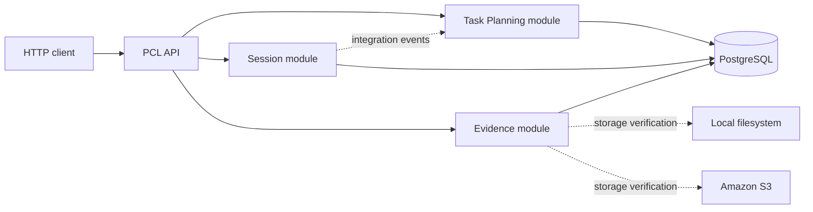
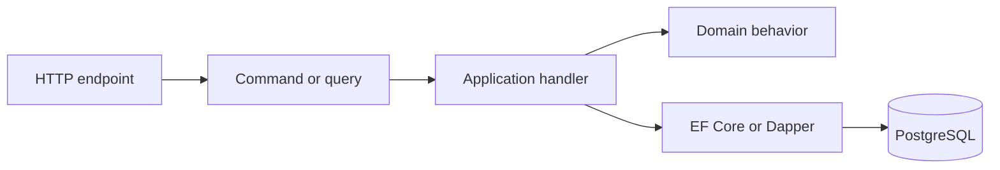
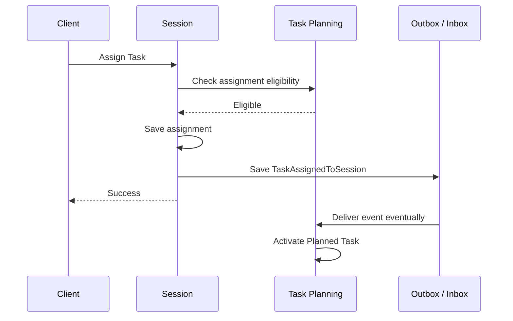
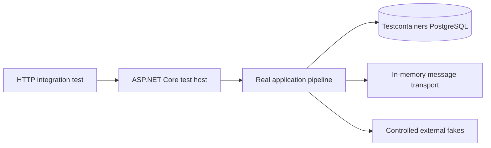

# Architecture

This document describes the implemented PCL backend. Future capabilities are documented in the [Roadmap](roadmap.md) and active [plans](plans/).

## System context

PCL currently consists of one ASP.NET Core API backed by PostgreSQL. Clients call HTTP endpoints exposed by independently owned business modules inside a modular monolith.



Authentication packages and infrastructure exist, but the current host does not enforce authorization. Clients supply owner IDs in public request contracts.

## Architectural style

### Modular monolith

The API deploys as one process, while each business capability owns its domain model, application use cases, persistence, presentation endpoints, and integration contracts.

Implemented modules:

| Module | Responsibility | Database schema |
| :--- | :--- | :--- |
| Task Planning | Intended work and Task lifecycle | `task_planning` |
| Session | Bounded execution and Task assignments | `session` |
| Evidence | Session Evidence and storage profiles | `evidence` |

The `Common` projects contain shared abstractions and cross-cutting infrastructure. They must not become a shared business domain.

### Layering

Each module follows the same dependency direction:

```text
Presentation -> Application -> Domain
Infrastructure -> Application + Domain
Contracts -> contract types only
PCL_API -> module composition
```

- **Domain** owns aggregates, entities, value objects, domain events, and business rules.
- **Application** owns commands, queries, handlers, orchestration, and interfaces required by use cases.
- **Infrastructure** implements persistence, queries, messaging, jobs, and external providers.
- **Presentation** maps HTTP endpoints and request/response contracts.
- **Contracts** exposes narrow provider-owned cross-module application contracts or integration contracts.

Detailed dependency rules are authoritative in [Module boundaries](module-boundaries.md).

## Request processing

The application uses CQRS with MediatR. State-changing HTTP requests dispatch commands; reads dispatch queries.



EF Core is used for transactional writes, aggregate persistence, migrations, and outbox/inbox storage. Dapper is used for read projections and query-oriented access.

Each module owns its `DbContext` and schema. Entity mappings live in dedicated `IEntityTypeConfiguration<T>` classes; shared Outbox/Inbox mappings are registered at the context level.

## Module communication

Modules use two communication styles:

### Synchronous application contracts

Use a narrow contract owned by the provider module when another module needs an immediate answer to enforce a hard invariant in the current request.

For example, Session asks Task Planning whether a Task exists, has the same owner, and is eligible for assignment. The consumer does not load the Task aggregate or query Task Planning tables.

### Integration events

Use an integration event when the source transaction should commit independently and another module can react eventually.

Assigning a Task demonstrates both styles:



The assignment can be visible in Session before the Task read model becomes Active. Consumers must handle duplicate delivery and must not assume global transactions across modules.

## Reliable messaging

Domain work and outgoing integration-event data are saved in the same database transaction.

Outbox flow:

```text
business change -> outbox row -> commit -> scheduled processor -> MassTransit publish
```

Inbox flow:

```text
message receive -> inbox row -> scheduled processor -> integration handler
```

The development configuration runs module processors at 30-second intervals. Integration tests use an in-memory transport and explicitly invoke configured processors so cross-module assertions are deterministic.

## Evidence storage boundary

The Evidence module owns storage-profile administration. Profiles describe deployment-level Local or Amazon S3 storage and are verified before creation or selection.

Provider-specific types remain in Infrastructure. Domain and Application code operate through PCL abstractions. AWS credentials are not stored in profiles or accepted through HTTP; the AWS SDK uses the process credential chain.

FileReference Evidence uses the active storage profile through a provider-neutral Application contract. Local files stream through the API to a bounded temporary file before an atomic move; Amazon S3 uploads use short-lived presigned PUT requests. Provider metadata is verified before a file becomes Ready, and downloads are API streams for Local or short-lived presigned URLs for S3.

Evidence runs bounded one-minute reconciliation and cleanup jobs. Reconciliation recovers uploads whose clients disconnected before confirmation; cleanup removes retained terminal or soft-removed file bytes after seven days. Provider calls occur outside the originating request transaction and are safe to retry.

## API host

`be/PCL_API` is the composition root. It:

- registers Common infrastructure and the three module assemblies
- loads the shared PostgreSQL connection string
- registers module consumers and background jobs
- maps module endpoints
- exposes Swagger in Development
- applies EF Core migrations at Development startup

Routes are currently mounted at the root, such as `/tasks` and `/lsessions`, not below `/api`.

## Testing architecture

The integration suite calls the real application through an in-process ASP.NET Core test host. PostgreSQL and migrations are real; nondeterministic external boundaries are controlled.



One shared fixture amortizes host and container startup. Respawn resets application tables before each test, mutable fakes are reset, and suite parallelism is disabled while the database is shared. See the [integration-test README](../be/PCL_API.IntegrationTests/README.md).

## Architectural constraints

- No module directly reads or writes another module's database tables.
- No module references another module's Domain, Application, Infrastructure, or Presentation project.
- Hard cross-module validation uses narrow provider-owned contracts.
- Eventual reactions use integration events and tolerate duplicate delivery.
- Derived future features such as Replay, analytics, and AI remain downstream from transactional truth.
- The monolith must not be treated as a distributed system merely to prepare for hypothetical service extraction.
