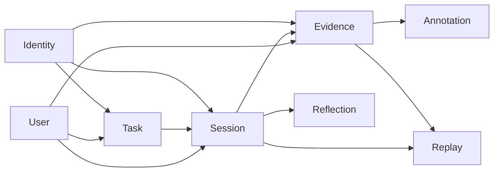

# Context Map — Personal Cognition Ledger

## Purpose

This document defines how the system is divided into logical parts (bounded contexts) and how those parts interact.

This is not a microservices design.  
All contexts live inside a **modular monolith**.

---

## Overview

The system is composed of the following bounded contexts:

- Session
- Task Planning
- Evidence / Artifact
- Annotation / Workspace
- Replay / Timeline
- Reflection / Learning Insight
- Identity / User

Each context has a clear responsibility and boundary.

---

## High-Level Structure

---

# Core Domain Overview

## Session (Core)
The central transactional context.

### Responsible for
- session lifecycle (start, stop)
- session state
- session ownership
- linking tasks and evidence

This is the core domain.

---

## Task Planning
Handles user intention.

### Responsible for
- task creation
- task categorization
- reusable task templates

### Relationship
- Supplies intent to Session

---

## Evidence / Artifact
Handles proof of activity.

### Responsible for
- evidence items
- file metadata
- storage references

### Relationship
- Attached to Session
- Upstream of Annotation
- Feeds Replay

---

## Annotation / Workspace
Handles user interaction with evidence.

### Responsible for
- highlights
- comments
- notes on evidence

### Relationship
- Depends on Evidence

---

## Replay / Timeline
Read-only, derived context.

### Responsible for
- reconstructing session history
- chronological views

### Relationship
- Consumes Session + Evidence

### Important
- Must NOT contain business rules

---

## Reflection / Learning Insight
Captures user conclusions.

### Responsible for
- reflection
- summaries
- learning outcomes

### Relationship
- Depends on Session completion

---

## Identity / User
Supports all contexts.

### Responsible for
- user data
- preferences
- ownership

---

# Architecture Structure

## Upstream vs Downstream

### Upstream (Source of Truth)
- Session
- Task Planning
- Evidence

These produce core data.

### Downstream (Derived / Dependent)
- Annotation
- Replay
- Reflection

These depend on upstream data.

### Supporting
- Identity

---

# Relationship Patterns

## 1. Session as Central Hub
Session connects:
- Task (intent)
- Evidence (proof)
- Reflection (conclusion)

## 2. Task → Session
- Task defines intent
- Session records execution

## 3. Evidence → Annotation
- Evidence must exist before annotation

## 4. Session + Evidence → Replay
- Replay is built from events and data
- Replay is read-only

## 5. Session → Reflection
- Reflection occurs after session ends

---

# Communication Model

## Synchronous (Commands)
Used for:
- start/stop session
- attach task
- add evidence
- create annotation
- submit reflection

## Domain Events (Internal)
Used for:
- cross-context reactions

### Examples
- SessionStarted
- EvidenceItemAdded
- SessionStopped

Handled inside the monolith.

## Asynchronous Processing (Later)
Used for:
- OCR
- file processing
- AI features

Not required in early stages.

---

# Boundaries Rule
Each context:
- owns its own models
- does not directly modify another context’s data
- communicates via APIs or events

---

# Anti-Patterns to Avoid

## 1. Merging Contexts Too Early
Do NOT combine:
- Session + Task
- Evidence + Annotation

## 2. Replay Owning Logic
- Replay must never become a source of truth

## 3. Over-Engineering
- This is a modular monolith, not distributed services

---

# Initial Implementation Focus

## Start with
- Session
- Task Planning
- Evidence

## Add later
- Replay
- Reflection
- Annotation
