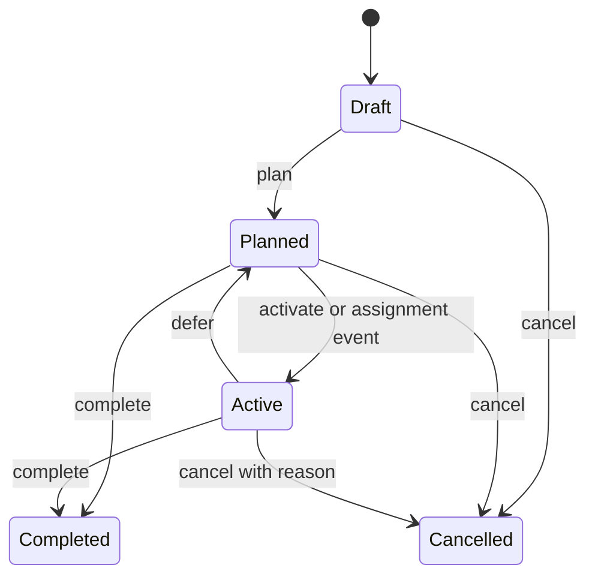
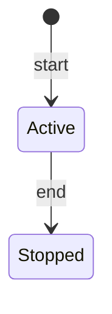
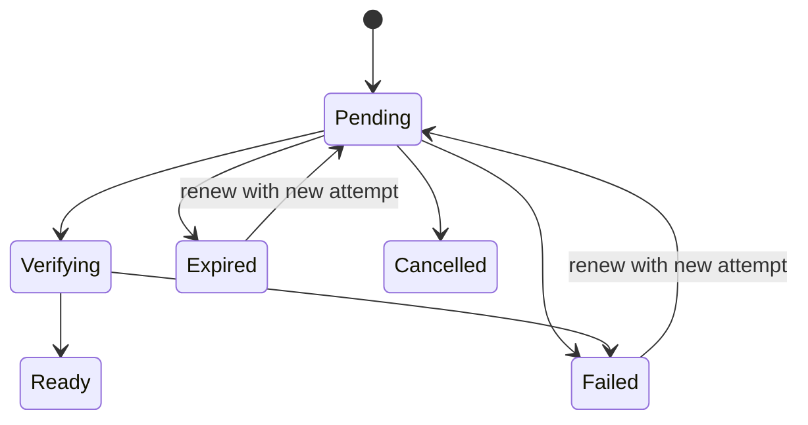

# Domain model

This document defines the current ubiquitous language, aggregate responsibilities, lifecycles, and business invariants. The [API reference](api/reference.md) defines transport contracts; the [Roadmap](roadmap.md) defines future scope.

## Core language

| Term | Meaning |
| :--- | :--- |
| **Task** | A declared intention for work the user plans to do |
| **Session** | A bounded period of execution that starts immediately and later stops |
| **SessionTaskAssignment** | The relationship between a Session and a Task |
| **EvidenceItem** | Proof or a meaningful record associated with a Session |
| **EvidenceFile** | File metadata and upload lifecycle attached to FileReference Evidence |
| **StorageProfile** | Deployment-level configuration for an Evidence storage provider |
| **Annotation** | Future user interpretation placed on Evidence; not currently implemented |
| **Timeline** | Future ordered projection of recorded facts |
| **Replay** | Future read-only presentation derived from a Timeline |
| **Reflection** | Future conclusion recorded after or about a Session |

Key distinctions:

```text
Task       = intention
Session    = execution boundary
Evidence   = proof or trace
Reflection = conclusion (future)
```

An **Artifact** is a possible kind of Evidence with a stored representation. It is not a synonym for all Evidence. The implemented code uses `EvidenceItem` and `EvidenceFile`; use those terms in current technical documentation.

## Ownership

Task, Session, and Evidence records carry an explicit `OwnerId`.

Current owner checks are domain-level ownership rules, not authentication. The HTTP host does not yet derive the owner from a verified identity. Documentation and code must not describe these checks as secure authorization.

## Task Planning

### Responsibility

Task Planning owns intended work: its wording, organization, priority, lifecycle, and eligibility for assignment. It does not own whether a Session is running or whether Evidence proves execution.

### Task lifecycle



| State | Meaning | Mutable details/category/priority |
| :--- | :--- | :---: |
| Draft | Captured intention not yet committed for execution | Yes |
| Planned | Organized and eligible for Session assignment | Yes |
| Active | Intended work currently considered in execution | Yes |
| Completed | Intended outcome was satisfied | No |
| Cancelled | Intention will not be pursued | No |

Completed and Cancelled are terminal. `Archived` is not an implemented state.

### Task invariants

- Owner ID and title are required.
- Title is limited to 200 characters and description to 4,000.
- Category and priority are optional and may be changed in Draft, Planned, or Active.
- Only Draft can be planned.
- Only Planned can be explicitly activated.
- Only Active can be deferred back to Planned.
- Planned or Active can be completed.
- Draft, Planned, or Active can be cancelled.
- Cancelling an Active Task requires a reason.
- Completion and cancellation timestamps cannot predate creation.
- Terminal Tasks cannot be refined, categorized, prioritized, or transitioned again.
- A Task is assignable to a Session when it belongs to the same owner, is Planned or Active, and is not assigned to another Active Session.

Assigning a Planned Task produces an eventual activation reaction. Removing an assignment does not automatically defer the Task.

## Session

### Responsibility

Session owns the bounded execution period, its owner, title, lifecycle, and Task assignment identities. It does not own Task lifecycle decisions or Evidence storage.

Creating a Session means starting it immediately; there is no Draft Session.



### Session invariants

- Owner ID, title, and start time are required.
- Only one Active Session may exist for an owner.
- End time cannot precede start time.
- A Session can stop only once.
- Task assignments may be added or removed only while the Session is Active.
- The same Task cannot be assigned twice to one Session.
- A Task cannot be assigned to two Active Sessions.
- Assigned Task and Session owners must match.
- Stopping a Session does not complete, cancel, or defer assigned Tasks.
- Stopped Sessions remain readable.

The Session aggregate stores assigned Task IDs, not Task aggregates. Immediate eligibility comes from a Task Planning application contract.

## Evidence

### EvidenceItem responsibility

An EvidenceItem records proof or a meaningful trace associated with a Session. Implemented public types are:

| Type | Meaning | Current creation path |
| :--- | :--- | :--- |
| Note | Free-form textual Evidence | Generic Evidence endpoint |
| Link | Absolute HTTP or HTTPS reference | Generic Evidence endpoint |
| FileReference | Evidence backed by a managed file lifecycle | Dedicated file-upload initialization endpoint |

### EvidenceItem invariants

- The item belongs to one Session and one owner.
- New Evidence can be added only when the referenced Session exists, is Active, and has the same owner.
- Note content is required and limited to 10,000 characters.
- Link content is required, limited to 2,048 characters, and must be an absolute HTTP or HTTPS URL.
- FileReference cannot be created through the generic Note/Link endpoint.
- Removal is a soft delete and is idempotent.
- Removal timestamp cannot predate the Evidence addition.
- Removal reason is limited to 1,000 characters.
- Current behavior permits removal after the Session has stopped.
- Removed Evidence is excluded from ordinary lists unless explicitly requested.

### EvidenceFile lifecycle

The mapped upload workflow drives this lifecycle:



The model records expected file metadata, checksum, the selected storage-profile identity, expiry, upload time, version, and failure information. Renewal preserves the logical EvidenceFile while archiving the previous attempt and assigning a fresh attempt and object identity. Current domain limits include a 25 MiB maximum, an allowed content-type policy, and a required Base64 SHA-256 checksum. Provider metadata verification is required before Ready.

Initialization retries are owner-scoped by an idempotency key. Expired Pending uploads are reconciled against provider metadata. Bytes associated with expired, failed, cancelled, superseded, or removed Evidence are retained for seven days and then deleted asynchronously and idempotently.

### StorageProfile responsibility

A StorageProfile describes a Local or Amazon S3 storage target. It belongs to deployment administration rather than an individual user.

Current invariants:

- Profile names are required and unique.
- A profile is verified before it is stored and before it becomes active.
- Local roots must be under an administrator-configured allowed root and must be writable.
- Amazon S3 configuration stores bucket, region, and optional prefix, never access keys.
- Only one profile is selected as the active storage setting.
- Existing records must retain the storage profile/location used for their file even if the active profile later changes.

## Cross-module rules

- Task Planning owns Task truth.
- Session owns Session and assignment truth.
- Evidence owns Evidence and storage truth.
- A module may keep local identifiers or projections needed for its own behavior, but those do not transfer ownership.
- Synchronous contracts answer immediate eligibility questions without exposing provider aggregates.
- Integration events communicate committed facts and may be delivered more than once.

See [Module boundaries](module-boundaries.md) for dependency and contract design rules.

## Future concepts

Activity, Annotation, Replay, Reflection, and Insight are not implemented domains. They may be explored only when a product use case justifies them. Until then:

- do not add their states or aggregates to current diagrams
- do not make transactional modules depend on them
- do not allow Replay or AI interpretation to become a source of truth
- record only concise intent in the [Roadmap](roadmap.md), not detailed speculative lifecycles
