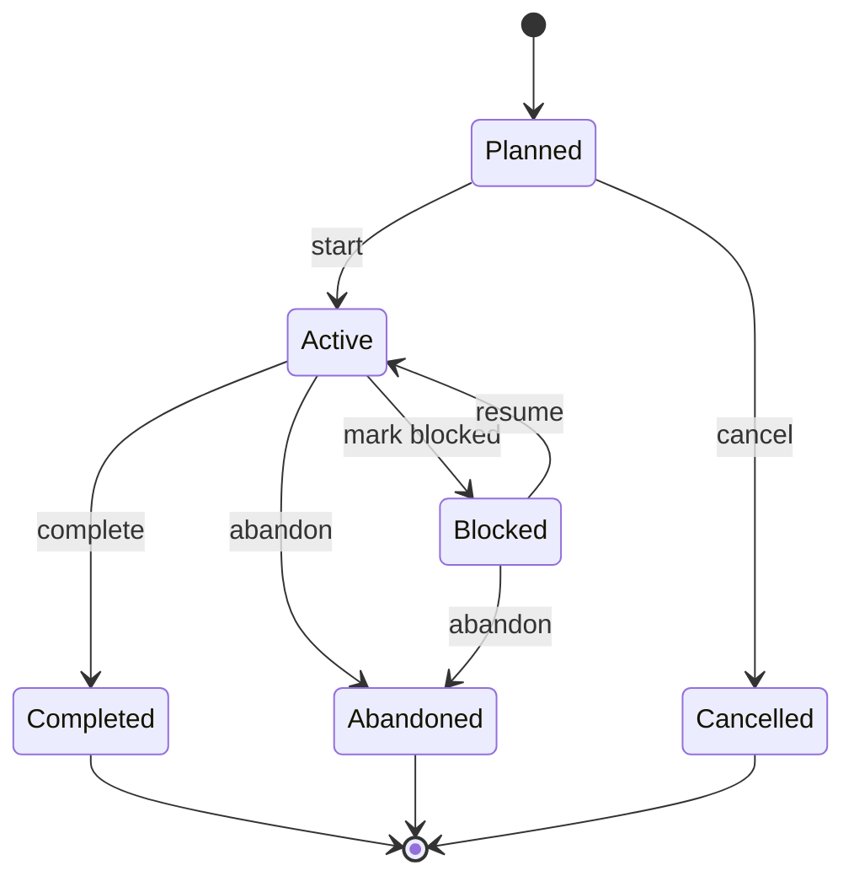

# Activity Lifecycle - Personal Cognition Ledger

## Purpose

This document defines the lifecycle, state transitions, and business rules for Activity within Personal Cognition Ledger.

Activity represents granular execution inside a Session.

It answers:

- what the user actually did
- when that work began and ended
- how the work progressed
- what task, evidence, or checkpoint it relates to

Activity is not the Session lifecycle.

Session defines the bounded execution container.  
Activity defines meaningful work units inside that container.

---

## Core Concept

An Activity is a tracked unit of execution that happens during a Session.

Examples:

- reading documentation
- implementing a feature
- debugging an issue
- practicing listening
- reviewing evidence
- writing a reflection note draft
- reaching a manual checkpoint

Activity is more specific than Session and more execution-oriented than Task.

```text
Task = intent
Session = execution boundary
Activity = granular execution
Evidence = proof
Reflection = conclusion
```

---

## Relationship Between Activity and Session

A Session may contain many Activities.

Each Activity must belong to exactly one Session.

The Session remains the upstream execution container and owns whether execution is currently allowed. Activity must respect Session state, but Activity should not redefine Session rules.

### Rules

- Activity can only be started inside an Active Session.
- Activity must reference an existing Session.
- Activity cannot outlive its Session.
- Activity timestamps must fit within the Session time boundary.
- Stopping a Session must prevent new Activity from starting.
- A stopped Session should not allow Activity mutation, except for explicit future correction workflows.

### Boundary

Session owns:

- session identity
- session lifecycle state
- session start and stop times
- active session consistency

Activity owns:

- activity identity
- activity purpose
- activity lifecycle state
- activity start and end times
- activity-level progress and outcome markers
- activity-level domain events

---

## Activity States

### Planned

An activity that has been declared but not started.

Characteristics:

- no start time
- no end time
- may be linked to a Task
- may be reordered, renamed, or removed while the Session remains mutable

Planned is optional in strict V1 flows. If activities are created only when execution begins, they may start directly as Active.

---

### Active

An activity currently being performed.

Characteristics:

- start time is set
- end time is not set
- evidence may be attached
- checkpoints may be recorded
- progress notes may be added

Active means work is happening now inside an Active Session.

---

### Blocked

An activity that cannot currently progress because of a known obstacle.

Characteristics:

- start time is set
- end time is not set
- blocker reason is recorded
- activity may later resume or be abandoned

Blocked does not stop the Session.

The user may switch to another Activity while the Session remains Active.

---

### Completed

An activity that reached its intended local outcome.

Characteristics:

- end time is set
- outcome may be recorded
- no further progress changes are allowed
- evidence links remain readable

Completed applies to Activity because activities can have local outcomes.

This does not imply the Session is completed or stopped.

---

### Abandoned

An activity that was intentionally stopped without reaching its local outcome.

Characteristics:

- end time is set
- abandonment reason should be recorded
- no further progress changes are allowed
- useful for later reflection and friction analysis

Abandoned is different from Blocked.

Blocked means the activity may continue later.  
Abandoned means the activity is intentionally closed.

---

### Cancelled

A planned activity that was removed from the execution plan before it began.

Characteristics:

- no start time
- no end time
- cancellation reason may be recorded
- should not appear as executed work

Cancelled is only valid before execution begins.

---

## State Transitions



---

## Transition Rules

### Start Activity

Initial state:

- Planned

Resulting state:

- Active

Rules:

- Session must be Active.
- Activity must not already have a start time.
- Activity must not be Completed, Abandoned, or Cancelled.
- StartedAt must be within the Session boundary.

Effects:

- set StartedAt
- emit `ActivityStarted`

---

### Mark Activity Blocked

Initial state:

- Active

Resulting state:

- Blocked

Rules:

- Activity must be Active.
- Blocker reason should be recorded.
- Session must still be Active.

Effects:

- record blocker reason
- emit `ActivityBlocked`

---

### Resume Activity

Initial state:

- Blocked

Resulting state:

- Active

Rules:

- Session must be Active.
- Activity must not be terminal.

Effects:

- record resume moment
- emit `ActivityResumed`

---

### Complete Activity

Initial state:

- Active

Resulting state:

- Completed

Rules:

- Activity must be Active.
- EndedAt must be set.
- EndedAt must be after StartedAt.
- Session must be Active.

Effects:

- set EndedAt
- record optional outcome
- emit `ActivityCompleted`

---

### Abandon Activity

Initial state:

- Active
- Blocked

Resulting state:

- Abandoned

Rules:

- Activity must have started.
- EndedAt must be set.
- EndedAt must be after StartedAt.
- reason should be recorded.
- Session must be Active.

Effects:

- set EndedAt
- record abandonment reason
- emit `ActivityAbandoned`

---

### Cancel Activity

Initial state:

- Planned

Resulting state:

- Cancelled

Rules:

- Activity must not have started.
- Activity must not have evidence attached.
- Session must still be mutable.

Effects:

- record optional cancellation reason
- emit `ActivityCancelled`

---

## Allowed Operations Per State

| Operation | Planned | Active | Blocked | Completed | Abandoned | Cancelled |
| :--- | :---: | :---: | :---: | :---: | :---: | :---: |
| Rename activity | Yes | Yes | Yes | No | No | No |
| Link to task | Yes | Yes | Yes | No | No | No |
| Start activity | Yes | No | No | No | No | No |
| Add progress note | No | Yes | Yes | No | No | No |
| Attach evidence | No | Yes | Yes | No | No | No |
| Mark blocked | No | Yes | No | No | No | No |
| Resume | No | No | Yes | No | No | No |
| Complete | No | Yes | No | No | No | No |
| Abandon | No | Yes | Yes | No | No | No |
| Cancel | Yes | No | No | No | No | No |
| Read activity | Yes | Yes | Yes | Yes | Yes | Yes |
| Include in replay | No | Yes | Yes | Yes | Yes | No |

Notes:

- Cancelled activities may remain auditable but should not appear as executed work.
- Completed and Abandoned activities are terminal.
- Late correction workflows are future scope and should be explicit.

---

## Business Constraints And Invariants

### Session Boundary Rules

- Every Activity belongs to exactly one Session.
- Activity cannot start unless its Session is Active.
- Activity cannot be changed after its Session is Stopped.
- Activity StartedAt cannot be earlier than Session StartedAt.
- Activity EndedAt cannot be later than Session EndedAt when the Session has stopped.
- A Session can stop while an Activity is Active or Blocked only if the application first closes that Activity or applies a clear stop policy.

Recommended V1 stop policy:

```text
Stopping a Session automatically abandons unfinished Active or Blocked Activities with reason: Session stopped.
```

This keeps Activity state deterministic without adding Session lifecycle states.

---

### Time Rules

- StartedAt is set exactly once when Activity becomes Active.
- EndedAt is set exactly once when Activity becomes Completed or Abandoned.
- EndedAt must be after StartedAt.
- Cancelled activities do not have StartedAt or EndedAt.
- Planned activities do not have StartedAt or EndedAt.

---

### State Rules

- Activity has exactly one lifecycle state at a time.
- Terminal states are Completed, Abandoned, and Cancelled.
- Terminal activities cannot return to Active.
- Blocked activities are still in progress and are not terminal.
- Completed means local activity outcome was reached.
- Abandoned means execution stopped before local outcome was reached.
- Cancelled means execution never began.

---

### Evidence Rules

- Evidence attached to Activity must also belong to the same Session.
- Evidence should only be attached while Activity is Active or Blocked.
- Evidence is proof of activity, not the activity itself.
- Removing or correcting evidence must follow Evidence context rules.

---

### Task Rules

- Activity may reference a Task when it is executing planned intent.
- Activity may exist without a Task for unplanned work discovered during a Session.
- Task remains intent. Activity records what actually happened.
- Completing an Activity does not automatically complete a Task unless a separate Task Planning rule defines that behavior.

---

## Domain Events

Activity should emit business-oriented domain events.

Core lifecycle events:

- `ActivityPlanned`
- `ActivityStarted`
- `ActivityBlocked`
- `ActivityResumed`
- `ActivityCompleted`
- `ActivityAbandoned`
- `ActivityCancelled`

Associated context events:

- `ActivityLinkedToTask`
- `EvidenceAttachedToActivity`
- `ActivityProgressNoted`
- `ActivityCheckpointReached`

Consumers may include:

- Replay / Timeline
- Reflection / Learning Insight
- Analytics
- AI pipelines

Important:

Replay consumes Activity events as source facts for read models.  
Replay must not own Activity lifecycle rules.

---

## Suggested Aggregate Boundaries

### Activity As Its Own Aggregate

Recommended when Activity has its own lifecycle and business rules.

Owns:

- activity identity
- session reference
- optional task reference
- activity type
- lifecycle state
- start and end times
- blocker reason
- outcome or abandonment reason
- activity domain events

Does not own:

- Session lifecycle
- Task definition
- Evidence storage
- Replay projections
- Reflection interpretation

This keeps Activity focused and compatible with the modular monolith architecture.

---

### Session And Activity Coordination

Session and Activity should coordinate through application-layer use cases or domain services when a rule requires checking both aggregates.

Examples:

- start Activity only when Session is Active
- stop Session and close unfinished Activities
- ensure Activity time boundaries fit Session time boundaries
- prevent Activity changes after Session is Stopped

These rules should not force Session to become a large aggregate containing all Activity behavior.

---

### Activity Type As Value Object Or Enumeration

Activity type should classify execution without controlling lifecycle.

Examples:

- Reading
- Coding
- Debugging
- Reviewing
- Practicing
- Writing
- Researching
- Planning
- Checkpoint
- NoteTaking

Activity type can support filtering, replay grouping, and future analytics.

It should not become a workflow engine.

---

## Examples Of Activity Types

### Reading

The user reads documentation, articles, or notes.

Possible evidence:

- link
- extracted snippet
- note
- highlight

---

### Coding

The user implements or changes software behavior.

Possible evidence:

- code snippet
- commit reference
- file reference
- terminal summary

---

### Debugging

The user investigates and narrows down a problem.

Possible evidence:

- error message
- log excerpt
- reproduction note
- screenshot

---

### Practicing

The user performs deliberate practice.

Possible evidence:

- exercise result
- self-rating
- mistake note
- repetition count

---

### Reviewing

The user reviews evidence, code, notes, or learning material.

Possible evidence:

- annotation
- comment
- highlight
- decision note

---

### Checkpoint

The user records a meaningful progress marker.

Possible evidence:

- manual checkpoint
- short note
- linked output

Checkpoint may later become its own concept if the business rules grow.

---

## Design Scope

### Included

- Activity as granular execution inside Session
- Activity lifecycle states
- Activity state transition rules
- Activity-level events
- Activity and Session boundary rules
- Activity relationship to Task and Evidence

---

### Excluded

- Session pause / resume
- Session restart
- workflow approval states
- AI-generated lifecycle decisions
- Replay ownership of Activity rules
- Evidence storage implementation
- database schema or API endpoint design

---

## Anti-Patterns To Avoid

### 1. Activity Replacing Session

Activity should not become the execution boundary.

Session remains the bounded period of intentional execution.

---

### 2. Activity Replacing Task

Activity records what happened.

Task records what was intended.

---

### 3. Too Many Activity States

Avoid states such as:

- WaitingReview
- AutoPaused
- PendingAI
- SmartComplete

unless they become real business concepts.

---

### 4. Infrastructure Language In The Domain

Avoid technical operation names as domain behavior.

Prefer:

```text
Start Activity
Complete Activity
Abandon Activity
Attach Evidence
Record Progress
```

Instead of:

```text
Insert Activity
Update Activity
Patch Status
Delete Row
```

---

## Final Recommendation

Keep Activity:

- granular
- session-bound
- lifecycle-aware
- event-oriented
- separate from Session lifecycle concerns

Activity should enrich the execution record without turning Session into a workflow engine.
