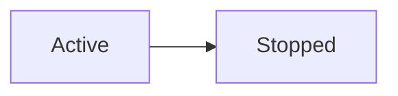
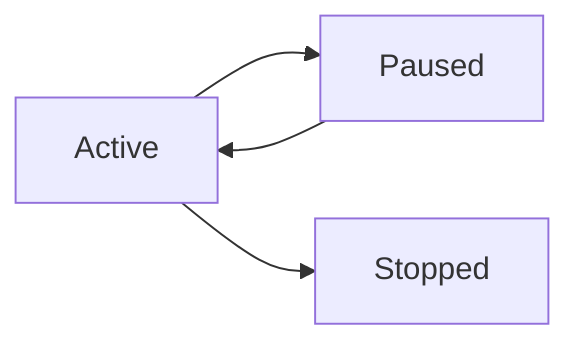

# Session Lifecycle Roadmap

## Purpose

This document defines the current and future direction of the Session lifecycle within Personal Cognition Ledger (PCL).

The goal is to keep Session small, deterministic, and transactionally reliable while allowing the surrounding ecosystem (Replay, Reflection, AI, Evidence) to evolve over time.

This document acts as a long-term domain scaling reference.

---

# Core Philosophy

A Session represents:

> a bounded period of intentional execution

It is not:

* a workflow engine
* a project container
* a planning board
* a collaborative process

The Session aggregate should remain focused on execution tracking and lifecycle consistency.

---

# Current Lifecycle (V1)

## Lifecycle States



---

## Active

A session that is currently running.

Characteristics:

* StartedAt is set
* session accepts activity/task references
* evidence may be attached
* timeline events may occur
* session is mutable

---

## Stopped

A session that has ended.

Characteristics:

* EndedAt is set
* lifecycle is complete
* core execution data becomes immutable
* replay and reflection become stable downstream consumers

A stopped session does NOT necessarily mean:

* goals were completed
* tasks were finished
* learning was successful

For this reason, the domain prefers the term:

```text
Stopped
```

instead of:

```text
Completed
```

---

# Current Business Rules

## 1. Session Starts Immediately

Creating a session means starting execution.

There is no Draft state in V1.

Example:

```text
Create Session
→ immediately Active
```

---

## 2. Only One Active Session Per User

A user may only have one Active session at a time.

This rule exists to maintain:

* clear execution context
* replay consistency
* evidence ownership clarity
* future AI context simplicity

Important:

This validation must NOT live inside the Session aggregate itself because it requires checking other sessions.

This rule belongs to:

* application layer
* domain service
* repository-backed validation

---

## 3. Session Can Only Stop Once

A stopped session cannot be stopped again.

---

## 4. Invalid Time Boundaries Are Rejected

EndedAt cannot be earlier than StartedAt.

---

## 5. Stopped Sessions Are Locked

After a session becomes Stopped:

* activities/tasks cannot be modified
* core execution data should remain stable

Future correction workflows may exist later, but they are not part of V1.

---

# Core Responsibilities

The Session aggregate currently owns:

* session identity
* title
* lifecycle state
* start time
* end time
* activity/task references
* lifecycle domain events

The aggregate should remain intentionally small.

---

# Explicit Non-Responsibilities

Session should NOT directly own:

* file storage
* annotations
* replay logic
* AI-generated insights
* OCR processing
* analytics
* summaries
* reflection interpretation

Those belong to downstream contexts.

---

# Domain Events

Session should emit business-oriented lifecycle events.

Examples:

```text
LSessionStartedDomainEvent
LSessionStoppedDomainEvent
```

These events are consumed by:

* Replay
* Reflection
* AI pipelines
* Timeline projections
* analytics systems

---

# Future Expansion Candidates

The following features are intentionally deferred until they become truly necessary.

---

## 1. Pause / Resume

Potential future lifecycle:



Potential use cases:

* temporary interruptions
* deep work tracking
* focus metrics

Risks:

* replay complexity
* timeline gaps
* duration calculations
* focus accuracy semantics

Not required for V1.

---

## 2. Checkpoints

A checkpoint represents an important milestone inside a session.

Examples:

* completed repository layer
* solved difficult bug
* reached lesson milestone
* understood concept

Checkpoints are highly compatible with:

* Replay
* Reflection
* AI insight generation

---

## 3. Timeline Enrichment

Future sessions may emit richer internal events.

Examples:

```text
TaskAttached
EvidenceAdded
CheckpointReached
ReflectionUpdated
```

Replay should consume these events as a read model builder.

Replay must remain downstream and read-only.

---

## 4. Continuation Sessions

A future relationship may exist between sessions.

Example:

```text
Session B continues Session A
```

Useful for:

* long-term learning
* multi-day implementation work
* recurring practice

This relationship should remain lightweight.

---

## 5. Focus Metrics

Potential future derived metrics:

* focused duration
* interruption count
* context switch frequency
* deep work score

These are derived analytics, not transactional truth.

---

## 6. AI Signals

Future AI systems may derive:

* friction points
* repeated mistakes
* productivity patterns
* learning signals

Important:

AI interpretation must NEVER become the source of truth.

The source of truth remains deterministic business data.

---

# Architectural Direction

Session is the transactional core.

Replay, Reflection, Analytics, and AI remain downstream consumers.

The architecture intentionally prefers:

```text
small transactional core
+
rich downstream interpretation
```

instead of:

```text
large intelligent aggregate
```

---

# Scaling Philosophy

As the system evolves:

Do:

* enrich timeline data
* improve replay
* improve evidence relationships
* derive insights downstream

Do NOT:

* overload Session with unrelated concerns
* turn Session into a workflow engine
* embed AI behavior into aggregate rules
* mix execution with interpretation

---

# Anti-Patterns To Avoid

## 1. Too Many Lifecycle States

Avoid:

* Draft
* Pending
* Approved
* WaitingReview
* SmartAutoPaused

unless they become truly required by business reality.

---

## 2. Replay Becoming a Source of Truth

Replay must remain derived.

Business rules belong upstream.

---

## 3. AI Coupling

AI should consume session facts.

AI should not redefine session facts.

---

## 4. Mixing Intent and Execution

Maintain distinction:

```text
Task = intent
Session = execution
Evidence = proof
```

This distinction is foundational to PCL.

---

# Final Recommendation

Keep Session:

* small
* explicit
* deterministic
* event-oriented

Allow system intelligence to emerge from:

* timelines
* evidence
* reflections
* downstream projections
* AI interpretation layers
