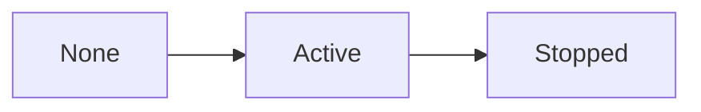

# Session Lifecycle - Personal Cognition Ledger

## Purpose

This document defines the lifecycle of a Session and the rules that govern its state transitions.

This is the first source of truth for backend Session behavior.

---

## Core Concept

A Session represents a bounded period of focused execution.

It records what actually happened during a period of work.

In V1, creating a Session means starting execution immediately.

There is no Draft state in the current Session model.

```text
Task = intent
Session = execution
Evidence = proof
Reflection = conclusion
```

---

## Current Lifecycle States

### Active

A Session that is currently running.

Characteristics:

- owner is known
- title is set
- StartedAt is set
- EndedAt is not set
- user may attach planned Task references
- evidence may be added by downstream contexts
- timeline facts may occur

Active means execution is happening now.

---

### Stopped

A Session that has ended.

Characteristics:

- EndedAt is set
- lifecycle is complete
- core execution data should remain stable
- replay and reflection can consume the Session as a stable fact

Stopped does not mean every Task was completed.

Stopped only means the execution period ended.

---

## State Transitions



---

## State Transition Rules

### Start Session

Initial state:

- none

Resulting state:

- Active

Rules:

- OwnerId must be provided.
- Title must be provided.
- StartedAt must be provided.
- A user may only have one Active Session at a time.

Effects:

- create Session identity
- assign readable Session Code
- set OwnerId
- set StartedAt
- set Status to Active
- emit `LSessionStartedDomainEvent`

Important:

The one-active-session rule requires checking other Sessions.  
It belongs in the application layer or repository-backed validation, not inside the Session aggregate alone.

---

### Stop Session

Initial state:

- Active

Resulting state:

- Stopped

Rules:

- Session must be Active.
- Session can only be stopped once.
- EndedAt must not be earlier than StartedAt.

Effects:

- set EndedAt
- set Status to Stopped
- emit `LSessionStoppedDomainEvent`

---

## Allowed Operations Per State

| Operation | Active | Stopped |
| :--- | :---: | :---: |
| Attach Task reference | Yes | No |
| Remove Task reference | Yes | No |
| Add Evidence | Yes | No |
| Add Annotation | Yes | No |
| Stop Session | Yes | No |
| Submit Reflection | No | Yes |
| View Timeline | Yes | Yes |
| Read Session | Yes | Yes |

Notes:

- Task assignment records intention inside execution.
- Evidence records proof of what happened.
- Reflection happens after execution ends.
- Future correction workflows must be explicit and auditable.

---

## Business Constraints And Invariants

### Ownership Rules

- Every Session belongs to one owner.
- OwnerId is required when starting a Session.
- Active Session uniqueness is scoped per owner.

---

### Time Rules

- StartedAt is set exactly once when the Session is created.
- EndedAt is set exactly once when the Session is stopped.
- EndedAt cannot be earlier than StartedAt.

---

### State Rules

- A Session has exactly one lifecycle state at a time.
- A Session cannot be Active without StartedAt.
- A Session cannot be Stopped without EndedAt.
- A Stopped Session cannot become Active again.
- A Stopped Session cannot be stopped again.

---

### Task Rules

- A Session may reference multiple Tasks.
- A Task represents intent, not execution.
- Stopping a Session must not automatically complete Tasks.
- Completing a Task must not automatically stop a Session.

---

### Evidence Rules

- Evidence may be attached while the Session is Active.
- Evidence belongs to downstream Evidence / Artifact behavior.
- Session should not own file storage or evidence processing.

---

## Domain Events

Core lifecycle events:

- `LSessionStartedDomainEvent`
- `LSessionStoppedDomainEvent`

Associated context events may include:

- `TaskAttachedToSession`
- `EvidenceItemAdded`
- `AnnotationCreated`
- `ReflectionSubmitted`

Replay and Reflection may consume these events.

They must remain downstream and derived.

---

## Design Scope V1

### Included

- immediate Session start on creation
- lifecycle transition: Active -> Stopped
- owner-scoped active Session validation
- immutable start and end timestamps
- readable numeric Session Code
- Task references as intention links

---

### Excluded

- Draft Session
- Pause / Resume
- Restarting Stopped Sessions
- automatic Task completion
- Session templates
- workflow approval states
- AI-generated lifecycle decisions

---

## Final Recommendation

Keep Session:

- small
- owner-scoped
- execution-focused
- lifecycle-explicit
- separate from Task planning

Task supplies intent.  
Session records execution.

