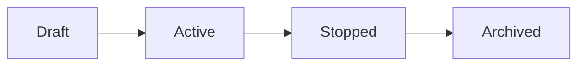

# Session Lifecycle — Personal Cognition Ledger

## Purpose

This document defines the lifecycle of a Session and the rules that govern its state transitions.

This is the first source of truth for backend behavior.

---

## Core Concept

A Session represents a bounded period of focused activity.

It moves through a defined set of states.

---

## Session States

### Draft

A session that has been created but not started.

- no start time
- no activity yet

---

### Active

A session that is currently running.

- start time is set
- user is performing activities
- tasks and evidence can be added

---

### Stopped

A session that has been ended.

- end time is set
- no further activity allowed (with some exceptions)

---

### Archived (Optional, Future)

A session that is locked and no longer editable.

Not required for V1.

---

## State Transitions

# Session Management Domain Model - Specification

## 1. Lifecycle States
A Session follows a strict linear lifecycle.

* **Draft**: The initial state upon creation. Configuration and preparation occurs here.
* **Active**: The session is currently in progress. Real-time data collection occurs here.
* **Stopped**: The session has concluded. Final analysis and reflections occur here.

## 2. State Transitions & Commands

### CreateSession
* **Description**: Initializes a new session.
* **Initial State**: None
* **Resulting State**: `Draft`
* **Domain Event**: `SessionCreated`

### StartSession
* **Description**: Commences the session tracking.
* **Initial State**: `Draft`
* **Resulting State**: `Active`
* **Rules**:
    * Cannot start if already `Active`.
    * Cannot start if already `Stopped`.
* **Effects**:
    * Set `start_time` to current timestamp.
    * Emit `SessionStarted`.

### StopSession
* **Description**: Ends the session tracking.
* **Initial State**: `Active`
* **Resulting State**: `Stopped`
* **Rules**:
    * Cannot stop if state is not `Active`.
    * Cannot stop twice (terminal state).
* **Effects**:
    * Set `end_time` to current timestamp.
    * Emit `SessionStopped`.

## 3. Permission Matrix (Allowed Actions)

| Action | Draft | Active | Stopped |
| :--- | :---: | :---: | :---: |
| Assign Tasks | Yes | Yes | No |
| Add Evidence | No | Yes | No* |
| Add Annotation | No | Yes | No |
| Reflection | No | No | Yes |
| View Timeline | Yes | Yes | Yes |
| Read Data | Yes | Yes | Yes |

*\*Optional Design Decision: Consider allowing late evidence in future versions.*

## 4. Domain Rules & Invariants

### Time Rules
* **Start Time**: Must be set exactly once when transitioning to `Active`. Immutable thereafter.
* **End Time**: Must be set when transitioning to `Stopped`.
* **Chronology**: `end_time` must be chronologically after `start_time`.

### Invariants
* A session cannot be `Active` without a `start_time`.
* A session cannot be `Stopped` without an `end_time`.
* A session cannot be simultaneously `Active` and `Stopped`.
* Evidence/Annotations must always reference a valid, existing session.

### Entity Rules
* **Tasks**: A session may have multiple tasks. Tasks can be added in `Draft` or `Active` states.
* **Evidence**: Strict Mode - Evidence can only be added while the session is `Active`.
* **Annotations**: Must reference an existing evidence item; cannot exist in isolation.
* **Reflections**: Can only be submitted once the session is `Stopped`. (V1 supports 1+ reflections per session).

## 5. Event Catalog

### Core Lifecycle Events
* `SessionCreated`
* `SessionStarted`
* `SessionStopped`

### Associated Context Events
* `TaskAttachedToSession`
* `EvidenceItemAdded`
* `AnnotationCreated`
* `ReflectionSubmitted`

## 6. Design Scope (V1)

### Included (Strict)
* Linear transition: Draft → Active → Stopped.
* Immutable start/end times once set.
* Strict evidence capture window (Active only).

### Excluded (Future Extensions)
* **No Pause/Resume**: Sessions are continuous.
* **No Re-starting**: Once stopped, a session remains stopped.
* **No Merging/Splitting**: Sessions are atomic units.
* **No Background Tracking**: Manual start/stop triggers only.
* **No Templates**: Sessions are created from scratch.