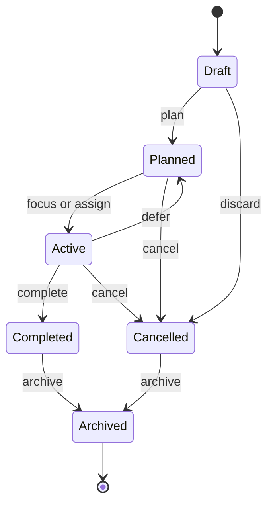

# Task Lifecycle - Personal Cognition Ledger

## Purpose

This document defines the lifecycle, state transitions, and business rules for Task within Personal Cognition Ledger.

A Task represents a declared intention for what the user plans to do.

It answers:

- what the user intends to work on
- why the work matters
- how the work should be categorized or prioritized
- whether the intention is still relevant
- whether the intended outcome has been satisfied

Task is planning-oriented.

It is not execution tracking.  
Actual execution is recorded by Session.

---

## Core Concept

A Task is a planned unit of intent.

Examples:

- read documentation
- implement feature
- debug issue
- practice listening
- review notes
- write summary
- investigate error

Task helps organize work before, during, and after Sessions.

```text
Task = intent
Session = execution
Evidence = proof
Reflection = conclusion
```

---

## Difference Between Task And Session

Task and Session must remain separate concepts.

### Task

Task represents what the user plans or wants to do.

Characteristics:

- may exist without a Session
- may be reused across Sessions
- may be planned before execution begins
- may be cancelled without any execution
- may be completed based on user judgment or fulfilled outcome

### Session

Session represents a bounded period of focused execution.

Characteristics:

- has start and end times
- records what actually happened
- owns execution time boundaries
- supplies source facts for replay and reflection
- may contain multiple Tasks

### Rule

Task does not prove that work happened.

Only Session, Evidence, Activity, and related timeline facts describe actual execution.

---

## Relationship Between Task And Session

A Task may exist without a Session.

A Session may contain multiple Tasks.

A Task may appear in multiple Sessions when work continues over time.

The relationship between Task and Session is represented by SessionTaskAssignment.

### Rules

- A Task can be planned before any Session exists.
- A Task can be assigned to an Active Session.
- A Task can be assigned to a future Session if future planning is supported.
- A Session may include one or more Tasks.
- Assigning a Task to a Session does not start execution by itself.
- Stopping a Session does not automatically complete assigned Tasks.
- Completing a Task does not stop any Session.

### Boundary

Task owns:

- task identity
- title and description
- planning state
- category
- priority
- optional due or target date
- completion or cancellation decision
- task-level domain events

Session owns:

- session identity
- execution lifecycle
- start and stop times
- execution facts
- attached task references
- session-level domain events

---

## Task Lifecycle States

### Draft

A task idea that has been captured but is not yet committed to a plan.

Characteristics:

- title may be incomplete
- category and priority may be missing
- not ready for assignment
- can be refined or discarded

Draft is useful when the user wants to capture intent quickly without deciding whether it belongs in a plan.

---

### Planned

A task that is ready to be considered for execution.

Characteristics:

- has a clear intention
- may have category and priority
- may be assigned to a Session
- may wait for a future Session

Planned does not mean work has started.

---

### Active

A task that is currently associated with an Active Session or is the user's current planning focus.

Characteristics:

- still represents intent
- may have one or more active Session assignments
- may receive evidence indirectly through Session execution
- may later return to Planned if work is deferred

Active Task does not mean the Task owns execution state.

Session remains the source of truth for actual execution.

---

### Completed

A task whose intended outcome has been satisfied.

Characteristics:

- completion time is recorded
- completion note may be recorded
- no further planning changes are allowed
- remains readable for replay, reflection, and historical context

Completed means the intention is fulfilled.

It does not mean a Session was completed.

---

### Cancelled

A task that is no longer intended.

Characteristics:

- cancellation reason should be recorded
- may have no Session history
- may have prior Session assignments
- remains readable for audit and reflection

Cancelled means the user intentionally chose not to pursue the task.

---

### Archived

A task that is hidden from active planning views but kept for history.

Characteristics:

- terminal from normal planning perspective
- may apply to Completed or Cancelled tasks
- should not be assigned to new Sessions

Archived is optional for V1.

---

## State Transitions



---

## State Transition Rules

### Plan Task

Initial state:

- Draft

Resulting state:

- Planned

Rules:

- Task must have a meaningful title.
- Task must describe an intention, not an execution result.
- Optional category and priority may be assigned.

Effects:

- mark the task as ready for planning
- emit `TaskPlanned`

---

### Focus Task

Initial state:

- Planned

Resulting state:

- Active

Rules:

- Task must be Planned.
- Task must not be Completed, Cancelled, or Archived.
- If linked to a Session, that Session must be Active.

Effects:

- mark the task as current planning focus
- emit `TaskActivated`

---

### Defer Task

Initial state:

- Active

Resulting state:

- Planned

Rules:

- Task must be Active.
- Task must not be completed or cancelled.
- Deferral reason may be recorded.

Effects:

- return task to planned backlog
- emit `TaskDeferred`

---

### Complete Task

Initial state:

- Planned
- Active

Resulting state:

- Completed

Rules:

- Task must not already be terminal.
- Completion must represent satisfied intent.
- Completion may reference one or more Sessions as supporting context.
- Completion must not require stopping a Session.

Effects:

- set CompletedAt
- record optional completion note
- emit `TaskCompleted`

---

### Cancel Task

Initial state:

- Draft
- Planned
- Active

Resulting state:

- Cancelled

Rules:

- Task must not already be terminal.
- Cancellation reason should be recorded.
- Cancelling a Task must not delete Session history.
- Cancelling a Task must not stop an Active Session.

Effects:

- set CancelledAt
- record cancellation reason
- emit `TaskCancelled`

---

### Archive Task

Initial state:

- Completed
- Cancelled

Resulting state:

- Archived

Rules:

- Task must already be terminal.
- Archived tasks cannot be assigned to future Sessions.
- Archived tasks remain readable.

Effects:

- mark task as archived
- emit `TaskArchived`

---

## Allowed Operations Per State

| Operation | Draft | Planned | Active | Completed | Cancelled | Archived |
| :--- | :---: | :---: | :---: | :---: | :---: | :---: |
| Refine title or description | Yes | Yes | Yes | No | No | No |
| Categorize task | Yes | Yes | Yes | No | No | No |
| Prioritize task | No | Yes | Yes | No | No | No |
| Assign to Session | No | Yes | Yes | No | No | No |
| Mark as focused | No | Yes | No | No | No | No |
| Defer | No | No | Yes | No | No | No |
| Complete | No | Yes | Yes | No | No | No |
| Cancel | Yes | Yes | Yes | No | No | No |
| Archive | No | No | No | Yes | Yes | No |
| Read task | Yes | Yes | Yes | Yes | Yes | Yes |
| Use as template source | Yes | Yes | Yes | Yes | No | No |

Notes:

- Completed, Cancelled, and Archived are terminal for normal planning behavior.
- Future correction workflows must be explicit and auditable.
- Reading historical tasks is always allowed.

---

## Task Completion And Cancellation Rules

### Completion

Completing a Task means the intended outcome has been satisfied.

Rules:

- Completion is based on the Task's intention.
- Completion may be supported by Session history or Evidence.
- Completion does not require a currently Active Session.
- Completion does not automatically stop a Session.
- Completion does not modify Evidence or Reflection.
- CompletedAt must be set exactly once.

Examples:

- The feature was implemented.
- The document was read.
- The practice goal was reached.
- The debugging question was answered.

---

### Cancellation

Cancelling a Task means the intention is no longer worth pursuing.

Rules:

- Cancellation should record a reason.
- Cancellation may happen before any Session exists.
- Cancellation may happen after partial Session work.
- Cancellation must preserve historical Session assignments.
- Cancellation must not remove Evidence.
- CancelledAt must be set exactly once.

Examples:

- The task is no longer relevant.
- The goal changed.
- The work was replaced by another task.
- The task was captured by mistake.

---

## Task Planning Vs Task Execution Boundaries

Task Planning owns intention.

It handles:

- task declaration
- task categorization
- task prioritization
- planned objectives
- task templates
- task-to-session assignment
- task completion and cancellation decisions

Session owns execution.

It handles:

- start and stop boundaries
- execution state
- evidence capture window
- timeline facts
- active session consistency

Activity, when introduced, may represent granular execution inside a Session.

Activity should not replace Task.  
Task should not become Activity.

---

## Business Constraints And Invariants

### Identity Rules

- Every Task has one owner.
- Task identity is stable across Sessions.
- A Task may exist without Session assignments.
- A Task may be assigned to multiple Sessions over time.

---

### State Rules

- A Task has exactly one lifecycle state at a time.
- Draft tasks are not ready for Session assignment.
- Planned tasks are eligible for Session assignment.
- Active tasks remain planning concepts, not execution records.
- Completed, Cancelled, and Archived tasks are terminal for normal planning.

---

### Session Assignment Rules

- SessionTaskAssignment links a Task to a Session.
- Assignment does not imply execution started.
- Assignment does not imply Task completion.
- Session history must remain stable if a Task is later cancelled or archived.
- A stopped Session should not accept new Task assignments.

---

### Categorization And Priority Rules

- Category describes the kind of intention.
- Priority describes planning importance.
- Category and priority should not affect Session lifecycle.
- Changing priority should not rewrite historical Session facts.

---

## Domain Events

Task should emit business-oriented domain events.

Core lifecycle events:

- `TaskDrafted`
- `TaskPlanned`
- `TaskActivated`
- `TaskDeferred`
- `TaskCompleted`
- `TaskCancelled`
- `TaskArchived`

Relationship events:

- `TaskAssignedToSession`
- `TaskRemovedFromSession`
- `TaskPriorityChanged`
- `TaskCategoryChanged`

Future template events:

- `TaskTemplateCreated`
- `TaskTemplateUsed`
- `RecurringTaskScheduled`

Consumers may include:

- Session
- Replay / Timeline
- Reflection / Learning Insight
- Analytics
- future planning views

Important:

Task events describe intention and planning changes.  
Session events describe execution facts.

---

## Suggested Aggregate Boundaries

### Task Aggregate

Recommended as the owner of Task planning behavior.

Owns:

- task identity
- owner reference
- title and description
- lifecycle state
- category
- priority
- planned target or due date
- completion note
- cancellation reason
- task-level domain events

Does not own:

- Session lifecycle
- Session start or stop times
- Evidence storage
- Activity execution tracking
- Replay projections
- Reflection interpretation

---

### SessionTaskAssignment

Recommended as a relationship model between Task and Session.

It may belong to the Session aggregate when assignment is part of preparing or running a Session.

It may also be represented as its own relationship entity if assignment rules grow.

Owns:

- session reference
- task reference
- assignment time
- optional planning order
- optional assignment note

Does not own:

- Task lifecycle
- Session lifecycle

---

### Task Category

Task category may be a value object or controlled classification.

Examples:

- Reading
- Coding
- Debugging
- Practice
- Review
- Research
- Writing

Category supports planning and filtering.

It should not define execution behavior.

---

### Task Template Future

Reusable task templates are future scope.

A TaskTemplate may define reusable intent.

Examples:

- daily listening practice
- review pull request
- read documentation chapter
- debug production issue

Rules:

- Template is not a Task.
- Creating a Task from a template creates a new Task identity.
- Template changes should not rewrite historical Tasks.

---

### Recurring Task Future

Recurring tasks are future scope.

Potential rule:

```text
Recurring schedule creates planned Task instances.
```

The recurrence pattern should not turn Task into a calendar engine.

---

## Design Scope

### Included

- Task as intention and planning
- Task lifecycle states
- Task state transition rules
- Task completion and cancellation rules
- Task and Session relationship
- Task Planning boundaries
- Task domain events
- suggested aggregate boundaries

---

### Excluded

- Session execution lifecycle
- Activity execution tracking
- Evidence storage implementation
- database schema
- API endpoint design
- recurring task implementation
- task template implementation
- AI-generated task planning decisions

---

## Anti-Patterns To Avoid

### 1. Task Becoming Execution

Avoid using Task state to prove work happened.

Session remains the source of truth for actual execution.

---

### 2. Task Completion Stopping Session

Completing a Task should not stop a Session.

A Session may continue after one Task is completed.

---

### 3. Session Stop Completing Tasks Automatically

Stopping a Session should not automatically complete assigned Tasks.

A stopped Session means execution ended.  
It does not mean all intentions were fulfilled.

---

### 4. Too Many Planning States

Avoid states such as:

- Approved
- WaitingReview
- SmartSuggested
- AutoScheduled

unless they become real business concepts.

---

### 5. Infrastructure Language In The Domain

Use business-oriented behavior.

Prefer:

```text
Plan Task
Assign Task To Session
Complete Task
Cancel Task
Archive Task
```

Instead of:

```text
Insert Task
Update Task
Patch Status
Delete Row
```

---

## Final Recommendation

Keep Task:

- intention-focused
- independent from Session execution
- assignable to Sessions
- lifecycle-aware
- event-oriented
- suitable for a modular monolith

Task Planning should supply intent into Session.  
Session should record what actually happened.

