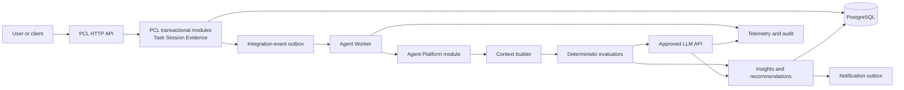
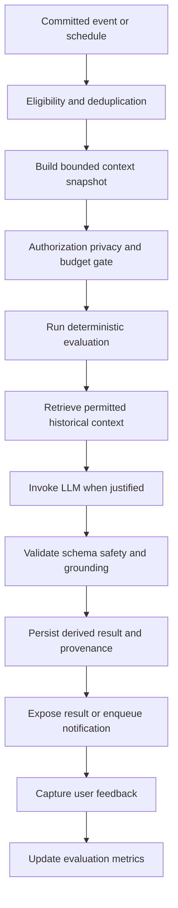

# Warning / 警告

The AI Agent must not be exposed until authentication-derived ownership is implemented. 認証から導かれる所有者管理を実装するまで、AI Agentを外部に公開してはいけません。The current `OwnerId` is business input, not a secure identity boundary.

The root issue is structural rather than individual: an autonomous worker can bypass UI workflows, process sensitive Evidence, retry operations, and eventually invoke tools. 問題の原因は個人ではなく、構造にあります。Without server-side authorization, data-egress controls, idempotency, and auditability, likely failures include cross-owner disclosure, duplicate notifications or actions, prompt-injection-driven behavior, and modifications that violate Task or Session invariants.

The highest-priority remediation is to establish authenticated ownership, deny-by-default permissions, an explicit LLM data-egress contract, and observation-only operation before enabling proactive notifications or write-capable tools. 最優先の対応は、認証済み所有者、既定で拒否する権限、明確なLLMデータ送信契約、観察専用の動作を確立することです。

# PCL AI Agent implementation roadmap / PCL AI Agent実装ロードマップ

## 1. Recommended direction / 推奨方針

Add an `Agent Platform` bounded context alongside the existing Task Planning, Session, and Evidence modules. 既存モジュールの横に、独立した境界を持つ`Agent Platform`を追加します。

Keep the current modular monolith. Do not redesign PCL into microservices. 現在のモジュラーモノリスを維持し、PCL全体をマイクロサービスへ再設計しません。Initially, place the agent domain and application code in the same repository and solution, while running background execution as a separately deployable .NET Worker.

The core rule is / 中心となる原則は次のとおりです。

> PCL records facts. The Agent Platform derives interpretations and recommendations from those facts.
>
> PCLは事実を記録します。Agent Platformは、その事実から解釈と推奨事項を作ります。

Agent output must never overwrite Task, Session, Evidence, or file lifecycle truth. Recommendations, evaluations, summaries, and predictions are derived records with provenance—not transactional facts. Agentの出力は派生情報であり、取引上の事実ではありません。

## 2. Overall architecture / 全体アーキテクチャ



PostgreSQL remains the initial system of record. PostgreSQLは最初の信頼できる記録元として使い続けます。Existing Outbox/Inbox integration should carry committed events into the Agent Platform. PostgreSQL-backed job claiming is sufficient for the first releases.

A message broker, dedicated vector database, separate agent service, or Kubernetes platform should be introduced only after telemetry demonstrates that the simpler design is inadequate. より複雑な基盤は、計測結果が必要性を示した後で導入します。

## 3. High-level module design / 上位モジュール設計

### Agent Control Plane / Agent管理面

This part manages configuration and governance. この部分は設定と統制を管理します。

- Agent definitions and versions
- Trigger and scheduling policies
- Prompt templates and versions
- Model policies
- Privacy and data-egress rules
- Per-owner feature settings
- Token and monetary budgets
- Notification preferences
- Plugin and tool permissions
- Approval policies

### Agent Runtime / Agent実行基盤

This part executes work. この部分は実際の処理を実行します。

- Event ingestion
- Job scheduling and claiming
- Run leases and heartbeats
- Context construction
- Deterministic evaluation
- LLM invocation
- Output validation
- Recommendation persistence
- Retry and dead-letter handling

### Agent Knowledge / Agent知識領域

This part contains derived, rebuildable information. この部分には、再構築できる派生情報を保存します。

- Session summaries
- Task progress projections
- User-approved preferences
- Historical recommendation outcomes
- Retrieval documents and embeddings
- Versioned context snapshots

It must not become another source of transactional truth. 取引上の事実を持つ別の情報源にしてはいけません。

### Agent Experience API / Agent利用API

This exposes / 次の情報と操作を公開します。

- Recommendations and insights
- Run status
- Explanation and provenance
- Feedback submission
- Notification preferences
- Approval requests
- Administrative diagnostics

A frontend is not required for the MVP. These capabilities can begin as API contracts. MVPではフロントエンドは不要で、API契約から始められます。

## 4. Domain records / ドメイン記録

The initial Agent Platform should introduce a small set of records. 最初は少数の明確な記録だけを導入します。

`AgentDefinition` identifies an analysis capability, its trigger, applicable policy, and enabled version.

`AgentRun` represents one execution. Suggested states are `Pending`, `Running`, `Succeeded`, `Failed`, `Skipped`, and `Cancelled`.

`ContextSnapshot` records the bounded, versioned input used for a run. Store references or redacted projections rather than unrestricted copies of Evidence. Evidenceの無制限なコピーではなく、参照または編集済みの情報を保存します。

`Recommendation` records an actionable suggestion. It includes owner, reason, confidence where meaningful, source facts, creation time, expiry, and status.

`Insight` records a non-actionable derived observation.

`PromptVersion` records the exact system and task prompt version used.

`ModelInvocation` records provider, model, parameters, token use, latency, cost estimate, and result category. Do not place full sensitive prompts in ordinary logs. 機密性の高い完全なプロンプトを通常ログに保存しません。

`AgentFeedback` records whether the user accepted, rejected, ignored, or rated a result.

`ToolApproval` records a requested operation, its preview, approver, decision, expiry, and execution result.

## 5. Agent lifecycle / Agentライフサイクル



The runtime should assume at-least-once event delivery. 実行基盤は、同じイベントが複数回届く可能性を前提にします。

Every run requires a stable deduplication key, such as / 各実行には、次のような安定した重複排除キーが必要です。

```text
AgentDefinitionId + AgentVersion + TriggerEventId + OwnerId
```

A worker claims a run with a time-limited lease. If the heartbeat expires, another worker may reclaim it. Reclamation must reuse the same run and operation identifiers. Any notification or tool side effect must therefore be idempotent. 通知やツールの副作用は、必ず冪等にします。

## 6. Event-driven integration / イベント駆動連携

The Agent Platform should consume public integration events rather than reaching into provider aggregates. Agent Platformは、他モジュールの集約へ直接アクセスせず、公開された統合イベントを利用します。

Useful initial events include / 最初に役立つイベントは次のとおりです。

- `SessionStarted`
- `SessionStopped`
- `SessionTaskAssigned`
- `SessionTaskRemoved`
- `TaskPlanned`
- `TaskActivated`
- `TaskDeferred`
- `TaskCompleted`
- `TaskCancelled`
- `EvidenceAdded`
- `EvidenceRemoved`
- `EvidenceFileReady`
- `EvidenceFileFailed`

Events should include stable identifiers, occurrence time, schema version, correlation ID, and authenticated owner identity once available. They should not contain unrestricted Note text, file contents, presigned URLs, credentials, or unnecessary personal information. イベントには不要な個人情報や機密データを含めません。

The Agent Platform may maintain local projections for analysis, but Task Planning, Session, and Evidence remain authoritative. 分析用のローカル投影は持てますが、元モジュールが引き続き正となります。

## 7. Data collection and storage / データ収集と保存

### Transactional data / 取引データ

Continue storing Task, Session, Evidence, and storage metadata in their owning modules. 各データは、それを所有するモジュールに保存し続けます。

### Agent operational data / Agent運用データ

Use dedicated PostgreSQL schemas or tables for / 専用のPostgreSQLスキーマまたはテーブルを使います。

- Runs and leases
- Inbox and deduplication
- Context snapshots
- Recommendations and insights
- Prompt and model versions
- Feedback
- Budgets
- Tool approvals
- Audit history

### Large derived content / 大きな派生コンテンツ

Use object storage only when snapshots or generated artifacts become too large for PostgreSQL. Store immutable object references, hashes, retention dates, and access classifications. PostgreSQLには大きすぎる場合だけオブジェクトストレージを使います。

### Retention / 保存期間

Define retention from the first LLM-enabled phase. LLMを使う最初の段階から保存期間を定義します。

- Short retention for raw context snapshots
- Longer retention for redacted provenance and evaluation metrics
- Configurable retention for recommendations
- No indefinite storage of raw prompts by default
- Delete and rebuild support for derived memories
- Owner deletion propagated to summaries, embeddings, caches, and queued jobs

## 8. Context and memory design / コンテキストとメモリ設計

Use four distinct kinds of context. 4種類のコンテキストを明確に分けます。

### Run context / 実行コンテキスト

A short-lived snapshot created for one execution. It contains only data needed for that agent definition. 1回の実行だけで使う短期的なスナップショットです。

### Working memory / 作業メモリ

Temporary intermediate state inside a run. It expires when the run finishes or its recovery period ends. 実行中だけ使う一時的な中間状態です。

### Episodic memory / エピソード記憶

Versioned summaries of previous Sessions, recommendations, and feedback. It is derived and rebuildable. 過去のSessionなどを要約した、再構築可能な派生情報です。

### Explicit user memory / 明示的なユーザーメモリ

Preferences intentionally supplied or approved by the user, such as preferred focus duration or notification time. ユーザーが意図的に登録または承認した設定です。

Do not create an unrestricted “user memory” table containing every historical fact. Memory must be purpose-specific, owner-scoped, retention-controlled, and traceable to source records. 全履歴を無制限に保存するメモリを作ってはいけません。

Start with SQL queries and compact summaries. Add `pgvector` only after retrieval evaluation shows a measurable benefit over structured filtering and PostgreSQL full-text search. まずSQLと短い要約を使い、効果を測定してから`pgvector`を検討します。

## 9. Initial evaluation pipeline / 初期評価パイプライン

The first useful agent should run after `SessionStopped`. 最初の実用的なAgentは、`SessionStopped`の後に実行します。

It can calculate deterministic facts such as / 次のような決定的な事実を計算できます。

- Session duration
- Number and types of Evidence items
- Assigned Task states
- Whether an assigned Task was completed
- Whether no Evidence was recorded
- Difference from the user’s recent Session pattern

The LLM may then generate one short reflection prompt or next-action suggestion from an explicitly permitted, redacted snapshot. LLMは、許可され編集済みのスナップショットから、短い振り返り質問または次の行動案を1つ生成できます。

The result should identify / 結果には次を示します。

- What facts were used
- Which parts are derived interpretation
- The prompt and model version
- When the recommendation expires
- Why the recommendation was generated

Avoid productivity scores in the initial releases. PCL’s product principles explicitly defer analytics, gamification, and AI interpretation until their responsibilities are clear. 初期リリースでは生産性スコアを避けます。

## 10. LLM integration strategy / LLM連携戦略

Define a provider-neutral interface such as `ILLMClient`. Provider adapters should handle model-specific transport, but policy decisions belong outside the adapters. `ILLMClient`のようなプロバイダー中立のインターフェースを定義します。

Required controls include / 必要な制御は次のとおりです。

- Approved, training-opted-out API access
- Timeouts and cancellation
- Rate-limit handling
- Retry with exponential backoff and jitter
- `Retry-After` compliance
- Circuit breakers
- Structured JSON output
- Maximum input and output token limits
- Per-owner and system-wide budgets
- Model allowlists
- Data-classification enforcement
- Invocation audit records
- Provider fallback only for compatible data policies

Do not silently resend sensitive content to a different provider after a failure. 失敗後に機密情報を別のプロバイダーへ自動送信してはいけません。

Use smaller models for classification, extraction, and formatting. Reserve more capable models for cases in which evaluation demonstrates a material quality improvement. 小さいモデルを優先し、品質向上が確認できる場合だけ高性能モデルを使います。

## 11. Prompt management / プロンプト管理

Prompts should be versioned application assets, not ad hoc strings embedded throughout handlers. プロンプトはバージョン管理されたアプリケーション資産として扱います。

Each prompt version should record / 各プロンプトバージョンには次を記録します。

- Purpose
- Input schema
- Output schema
- Allowed data classifications
- Model policy
- Evaluation dataset version
- Change reason
- Creation and activation times
- Rollback target

Prompts should separate instructions from untrusted content. Evidence notes, link content, file extracts, and retrieved text must be explicitly marked as data, not instructions. 命令と信頼できないデータを明確に分離します。

Prompt rollout should support shadow execution, limited rollout, comparison against the current version, and immediate rollback. 段階的な公開とすぐに戻せる仕組みが必要です。

## 12. Extensible plugin and tool architecture / 拡張可能なプラグインとツール設計

Do not implement write-capable tools in the MVP. MVPでは書き込み可能なツールを実装しません。

When introduced, every plugin should declare / 導入時、各プラグインは次を宣言します。

- Stable tool identifier and version
- Input and output schema
- Required permission scopes
- Read-only or state-changing classification
- Idempotency behavior
- Timeout and retry policy
- Data classifications accessed
- Whether approval is required
- Compensation or recovery procedure

A tool invocation should follow / ツール呼び出しは次の順序に従います。

```text
plan -> authorize -> validate -> preview -> approve -> execute -> verify -> audit
```

Validation or preview endpoints must never replace execution-time authorization and business-rule checks. 検証やプレビューは、実行時の認可と業務ルール確認の代わりにはなりません。

MCP or equivalent tool calls must not bypass application commands. A “complete Task” tool, for example, must invoke the same authorized application behavior as the HTTP API—not update a Task table directly. MCPから直接テーブルを更新してはいけません。

## 13. Security and permission model / セキュリティと権限モデル

The permission model should be deny-by-default. 権限モデルは既定で拒否します。

Before an agent reads data, the runtime must establish / Agentがデータを読む前に次を確定します。

- Authenticated actor or system identity
- Owner or tenant scope
- Agent definition being executed
- Permitted data categories
- Permitted purpose
- Allowed model provider
- Allowed output destination
- Budget
- Retention policy

For future tools, use narrow scopes such as `recommendation:create`, `task:read`, or `notification:send`. Avoid broad scopes such as `pcl:write`. 将来のツールには狭い権限範囲を使います。

Consequential actions require explicit approval unless a narrowly defined policy authorizes them. Completion, cancellation, Evidence removal, external messaging, and file disclosure should not be autonomous defaults. 重要な操作は原則として明示的な承認を必要とします。

File Evidence requires additional controls / File Evidenceには追加制御が必要です。

- Do not send raw files to an LLM by default
- Allow only approved MIME types and extraction paths
- Scan and classify extracted content
- Remove credentials, tokens, and sensitive fields
- Treat extracted text as untrusted
- Prevent presigned storage URLs from entering prompts
- Record the extractor and redaction versions

## 14. Data-egress contract / データ送信契約

Create a formal contract defining which fields may leave PCL’s trust boundary. PCLの信頼境界から外へ送信できる項目を、正式な契約として定義します。

For example, a Session reflection agent might receive duration, Task titles approved for AI processing, counts of Evidence types, and a redacted Note excerpt. It should not automatically receive full files, storage locations, upload metadata, unrelated Tasks, or another owner’s records. 必要最小限の情報だけを送信します。

Each agent definition should bind to a specific egress contract version. Automated golden-dataset tests must demonstrate that restricted fields and classified content cannot appear in provider-bound payloads. 自動テストで禁止データが外部送信されないことを確認します。

## 15. Background processing and scheduling / バックグラウンド処理とスケジュール

Start with a .NET Worker and PostgreSQL. 最初は.NET WorkerとPostgreSQLを使います。

Workers can claim due jobs using transactional locking and `FOR UPDATE SKIP LOCKED`. Add / 次の機能を追加します。

- Lease expiry
- Heartbeat updates
- Bounded concurrency
- Retry schedule
- Dead-letter state
- Manual replay
- Graceful shutdown
- Queue-age metrics
- Per-owner fairness
- Provider rate limiting

Use Quartz.NET when recurring calendar schedules become necessary. Do not add it solely for immediate event-triggered jobs. 定期スケジュールが必要になった時だけQuartz.NETを使います。

Move to a managed broker only when measured workload demonstrates database contention, unacceptable queue latency, or independent scaling requirements. 計測で必要性が確認できた場合だけ、管理型ブローカーへ移行します。

## 16. Recommended technology stack / 推奨技術スタック

Use the existing supported .NET version. Adopt .NET 10 if it aligns with the project’s runtime and support policy rather than upgrading solely for the Agent Platform. 現在サポートされている.NETバージョンを基本とします。

Recommended components are / 推奨コンポーネントは次のとおりです。

- ASP.NET Core and .NET Worker Service
- EF Core with Npgsql
- PostgreSQL
- Existing MediatR and Outbox/Inbox mechanisms
- Quartz.NET for recurring schedules when needed
- OpenTelemetry for traces, metrics, and logs
- Managed secrets and KMS
- S3-compatible object storage for large derived artifacts
- `pgvector` only after retrieval benchmarking
- Polly or equivalent resilience policies
- JSON Schema or strongly typed structured-output validation
- Testcontainers for PostgreSQL integration tests

Keep the repository as a GitHub monorepo so cross-module contracts, prompts, evaluations, migrations, and deployment definitions are reviewed together. Use protected branches, CODEOWNERS, pull requests, and CI/CD. GitHubモノレポとCI/CDによるレビューを推奨します。

## 17. Infrastructure and deployment / インフラとデプロイ

The first production topology can contain / 最初の本番構成には次を含めます。

- Existing PCL API deployment
- Two Agent Worker instances across availability zones
- Managed PostgreSQL with backups and point-in-time recovery
- Managed secrets
- Existing Evidence storage
- Centralized logs, metrics, traces, and alerts
- Approved external LLM API

Use separate development, test, staging, and production configurations. Database migrations must run and verify through CI/CD rather than manual production execution. 開発、テスト、ステージング、本番を分離し、DB移行はCI/CDで実行します。

Workers should be independently deployable and horizontally scalable, even though they share a modular-monolith repository and database. Workerは独立してデプロイ、スケールできるようにします。

## 18. Hardware requirements / ハードウェア要件

### Development / 開発環境

A practical baseline is / 実用的な基準は次のとおりです。

- Modern CPU with at least 8 cores
- 32 GB RAM minimum
- 64 GB recommended for containers, test databases, and agentic development tools
- 1 TB NVMe SSD
- No GPU required for API-based LLM integration

A GPU is justified only if local inference or embedding experiments become an approved requirement. API利用が中心ならGPUは不要です。

### Production / 本番環境

Do not size production from fixed hardware guesses. Start with two modest worker instances and measure / 固定的な推測ではなく、2台の小規模Workerから始めて次を測定します。

- Events per second
- Queue age and depth
- Concurrent runs
- Provider latency
- Tokens per minute
- PostgreSQL lock and I/O time
- Context-construction latency
- Memory per active run
- Notification throughput

Scale only the demonstrated bottleneck. Additional workers will not improve throughput if the limiting resource is PostgreSQL, a provider rate limit, or a serial context-building path. 実際に確認されたボトルネックだけを拡張します。

## 19. Observability and operations / 可観測性と運用

Every run should carry a trace ID and record / 各実行はtrace IDを持ち、次を記録します。

- Agent and version
- Trigger event
- Owner scope in access-controlled telemetry
- Run state and attempt
- Context and prompt version
- Model and provider
- Token usage and cost
- Latency by stage
- Validation result
- Retry reason
- Recommendation identifier
- Notification outcome
- Tool approval and result

Never write raw Evidence, full prompts, credentials, presigned URLs, or personal information to normal logs. 通常ログに生のEvidence、完全なプロンプト、認証情報、個人情報を書きません。

Operational dashboards should cover queue age, success rate, retry rate, dead letters, provider errors, token cost, budget rejection, output-validation failures, notification volume, and worker lease recovery.

Alerts require runbooks for provider outage, cost spikes, stuck leases, queue accumulation, failed deletion, privacy-policy rejection, and suspected cross-owner access. アラートには復旧手順書を用意します。

## 20. Testing strategy / テスト戦略

### Conventional tests / 通常テスト

Use domain unit tests, application tests, API tests, integration tests against real PostgreSQL, migration tests, contract tests, and end-to-end worker tests. 実際のPostgreSQLを使う統合テストも含めます。

### Delivery tests / 配信テスト

Verify duplicate integration events, out-of-order events, expired leases, worker crashes, retry exhaustion, notification idempotency, and dead-letter replay. 重複、順序違い、障害、再実行を検証します。

### AI evaluation / AI評価

Maintain versioned evaluation datasets for / 次の評価データセットをバージョン管理します。

- Relevance
- Groundedness
- Actionability
- Unsupported claims
- Privacy compliance
- Prompt-injection resistance
- Schema validity
- Appropriate refusal or skipping
- Repetition and notification fatigue

LLM-based evaluation may supplement—but not replace—deterministic assertions and human review. LLM評価は、人のレビューと決定的な検証を置き換えません。

### Security tests / セキュリティテスト

Include cross-owner isolation, forged owner IDs, tool-scope escalation, direct MCP invocation, prompt injection in Notes and files, malicious URLs, sensitive-data redaction, deletion propagation, and provider-payload inspection. 所有者間の分離やプロンプトインジェクションを必ず確認します。

### Performance tests / 性能テスト

Measure event ingestion, job claiming, context queries, queue delay, token rate, load, soak behavior, provider degradation, and PostgreSQL contention. 推測ではなく計測を先に行います。

## 21. Cost optimization / コスト最適化

Measure cost per successful useful recommendation, not merely cost per invocation. 1回の呼び出し費用ではなく、役立つ推奨1件当たりの費用を測ります。

Apply optimization in this order / 次の順序で最適化します。

1. Reduce unnecessary triggers and context volume.
2. Run deterministic rules before calling an LLM.
3. Deduplicate equivalent work.
4. Use compact versioned summaries.
5. Select the smallest model meeting evaluation thresholds.
6. Cache only stable, owner-scoped derived results.
7. Batch compatible offline evaluations.
8. Bound output length and retry count.
9. Enforce daily and monthly budgets.
10. Scale infrastructure only after profiling.

Do not use unrestricted semantic retrieval, multiple-agent debates, or repeated model calls as default architecture. 無制限の検索や複数Agentの議論を既定にしません。

## 22. Incremental implementation phases / 段階的な実装フェーズ

### Phase 0 — Secure foundation / 安全な基盤

Objective: establish the minimum safe identity boundary. 目的は、最低限安全なID境界を作ることです。

Implement authentication-derived `OwnerId`, server-side authorization, cross-owner rejection, agent-specific event contracts, threat modeling, and baseline tracing.

Deliverables include the authenticated ownership contract, integration-event catalog, initial threat model, and isolation test suite. 成果物には所有者契約、イベント一覧、脅威モデル、分離テストを含めます。

Exit criteria / 完了条件

- A caller cannot select another owner through request input.
- Cross-owner API and worker tests pass.
- Events carry trusted ownership scope.
- Agent processing remains disabled by default.

### Phase 1 — Observation-only MVP / 観察専用MVP

Objective: generate one trustworthy, non-invasive result after a Session stops. Session停止後に、信頼できる非侵襲的な結果を1つ作ります。

Implement `AgentDefinition`, `AgentRun`, inbox/deduplication, context snapshots, deterministic Session evaluation, one optional LLM reflection suggestion, recommendation retrieval API, prompt versioning, and provenance.

Add the first data-egress contract, redaction pipeline, consent or feature opt-in, and agent-data retention rules. 最初のデータ送信契約、編集処理、同意、保存ルールを追加します。

Required infrastructure is the existing PostgreSQL deployment, one development worker, approved LLM API, and OpenTelemetry.

Exit criteria / 完了条件

- Replaying an event does not create duplicate results.
- LLM outputs always pass the required schema or fail safely.
- Cross-owner data never enters a snapshot.
- Golden tests prove restricted file and Note content is excluded or redacted.
- Agent-derived records can be deleted and rebuilt.
- Human evaluation meets predefined quality thresholds.
- The agent cannot change PCL transactional state.

### Phase 2 — Reliable proactive recommendations / 信頼できる能動的な推奨

Objective: deliver useful recommendations without producing notification fatigue. 通知疲れを起こさず、有用な推奨を届けます。

Implement recurring schedules, recommendation expiry, notification preferences, cooldowns, semantic deduplication, feedback, retry policies, dead letters, budgets, and operational dashboards.

Exit criteria / 完了条件

- Notification volume remains within configured limits.
- Expired worker leases are safely reclaimed.
- Replayed side effects remain idempotent.
- Provider outage and rate-limit tests pass.
- Load and soak targets are met.
- Per-owner cost limits are enforced.

### Phase 3 — Controlled context and memory / 制御されたコンテキストとメモリ

Objective: improve relevance using historical context without creating an uncontrolled profile. 制御できない個人プロファイルを作らず、履歴で関連性を高めます。

Implement versioned Session summaries, explicit user preferences, structured historical retrieval, deletion propagation, and memory rebuild procedures. Evaluate PostgreSQL full-text search before adding vectors.

Exit criteria / 完了条件

- Retrieval quality exceeds the Phase 2 baseline.
- Every retrieved item is owner-scoped and source-traceable.
- Deleted records disappear from summaries, indexes, and caches.
- Rebuilding memory produces equivalent permitted results.
- Additional context provides measurable quality value.

### Phase 4 — Guarded tools and workflows / 保護されたツールとワークフロー

Objective: permit selected agent-initiated actions through existing application boundaries. 既存のアプリケーション境界を通して、選択した操作を許可します。

Implement the plugin manifest, permission scopes, dry-run and preview, approval workflow, execution-time validation, idempotency keys, optimistic concurrency, audit records, and compensation procedures.

Begin with low-risk actions such as drafting a Task or preparing a notification—not completing or cancelling work automatically. 最初はTaskの下書きなど、低リスクの操作に限定します。

Exit criteria / 完了条件

- Tools cannot update provider tables directly.
- Direct MCP or plugin calls cannot bypass authorization or business rules.
- Concurrent and duplicate requests do not create duplicate actions.
- Approval expiry and revocation work correctly.
- Recovery and compensation drills pass.
- All consequential actions are attributable and auditable.

### Phase 5 — Production hardening / 本番強化

Objective: operate the platform reliably under real production conditions. 実際の本番条件で安定運用できるようにします。

Implement multi-instance workers, zone redundancy, deployment health checks, disaster recovery, security review, red-team exercises, prompt/model canaries, rollback, capacity monitoring, cost dashboards, and operational runbooks.

Exit criteria / 完了条件

- Availability and queue-latency SLOs are met.
- Backup restoration is demonstrated.
- Prompt and model rollback is tested.
- Privacy deletion is verified end to end.
- Security findings are resolved or formally accepted.
- On-call staff can recover failed queues and provider outages using tested runbooks.

### Phase 6 — Evidence-based scale-out / 根拠に基づくスケールアウト

Objective: evolve architecture only where measurements justify it. 計測結果が必要性を示す部分だけアーキテクチャを発展させます。

Possible changes include a managed message broker, separate Agent Platform service, dedicated vector search, isolated model gateway, or specialized worker pools.

Exit criteria / 完了条件

- Profiling identifies a concrete bottleneck.
- The proposed change measurably improves latency, throughput, cost, or operability.
- Ownership and transaction boundaries remain explicit.
- Migration and rollback procedures are tested.
- Added operational complexity has an assigned owner.

## 23. Main risks and common mistakes / 主なリスクとよくある誤り

The largest risks are allowing AI-derived interpretation to become transactional truth, using request-supplied ownership, sending excessive Evidence to providers, trusting generated JSON without validation, and enabling tools before authorization and idempotency exist. 最大のリスクは、AIの解釈を事実として扱うこと、所有者を入力値だけで信頼すること、過剰なデータ送信、未検証のJSON、早すぎるツール有効化です。

Other common mistakes include / その他のよくある誤りは次のとおりです。

- Building a generic multi-agent framework before proving one use case
- Adding vector search without a retrieval benchmark
- Sending every event to an LLM
- Storing unrestricted prompts forever
- Treating model confidence as calibrated probability
- Retrying state-changing operations without stable keys
- Allowing plugins to bypass application commands
- Logging sensitive context
- Hiding model or prompt changes from users and operators
- Scaling workers before finding the actual bottleneck
- Generating productivity scores that conflict with PCL’s evidence-first principles

## 24. Recommended first implementation slice / 推奨する最初の実装単位

The first end-to-end implementation should be / 最初のエンドツーエンド実装は次の内容にします。

> After an authenticated owner stops a Session, asynchronously evaluate the Session and create at most one optional reflection prompt, using a redacted context snapshot and without modifying any Task, Session, or Evidence record.
>
> 認証済みの所有者がSessionを停止した後、編集済みのコンテキストを使って非同期に評価し、任意の振り返り質問を最大1件作成します。Task、Session、Evidenceは変更しません。

This slice validates event integration, worker reliability, privacy controls, prompt management, structured output, provenance, evaluation, and cost accounting while preserving PCL’s existing domain boundaries. It is small enough to test thoroughly and useful enough to determine whether further Agent Platform investment is justified. この小さな実装で、既存の境界を守りながら主要な技術と安全性を検証できます。
