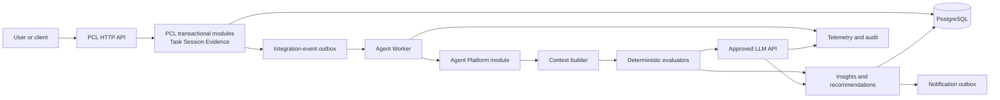
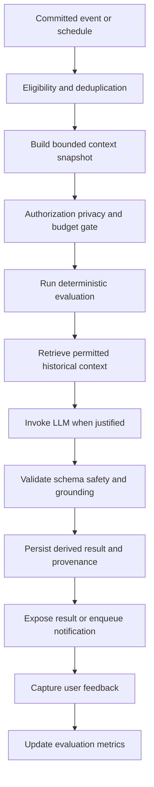

# Warning

The AI Agent must not be exposed until authentication-derived ownership is implemented. The current `OwnerId` is business input, not a secure identity boundary.

The root issue is structural rather than individual: an autonomous worker can bypass UI workflows, process sensitive Evidence, retry operations, and eventually invoke tools. Without server-side authorization, data-egress controls, idempotency, and auditability, likely failures include cross-owner disclosure, duplicate notifications or actions, prompt-injection-driven behavior, and modifications that violate Task or Session invariants.

The highest-priority remediation is to establish authenticated ownership, deny-by-default permissions, an explicit LLM data-egress contract, and observation-only operation before enabling proactive notifications or write-capable tools.

# PCL AI Agent implementation roadmap

## 1. Recommended direction

Add an `Agent Platform` bounded context alongside the existing Task Planning, Session, and Evidence modules.

Keep the current modular monolith. Do not redesign PCL into microservices. Initially, place the agent domain and application code in the same repository and solution, while running background execution as a separately deployable .NET Worker.

The core rule is:

> PCL records facts. The Agent Platform derives interpretations and recommendations from those facts.

Agent output must never overwrite Task, Session, Evidence, or file lifecycle truth. Recommendations, evaluations, summaries, and predictions are derived records with provenance—not transactional facts.

## 2. Overall architecture



PostgreSQL remains the initial system of record. Existing Outbox/Inbox integration should carry committed events into the Agent Platform. PostgreSQL-backed job claiming is sufficient for the first releases.

A message broker, dedicated vector database, separate agent service, or Kubernetes platform should be introduced only after telemetry demonstrates that the simpler design is inadequate.

## 3. High-level module design

### Agent Control Plane

This part manages configuration and governance:

- Agent definitions and versions
- Trigger and scheduling policies
- Prompt templates and versions
- Model policies
- Privacy and data-egress rules
- Per-owner feature settings
- Token and monetary budgets
- Notification preferences
- Plugin and tool permissions
- Approval policies

### Agent Runtime

This part executes work:

- Event ingestion
- Job scheduling and claiming
- Run leases and heartbeats
- Context construction
- Deterministic evaluation
- LLM invocation
- Output validation
- Recommendation persistence
- Retry and dead-letter handling

### Agent Knowledge

This part contains derived, rebuildable information:

- Session summaries
- Task progress projections
- User-approved preferences
- Historical recommendation outcomes
- Retrieval documents and embeddings
- Versioned context snapshots

It must not become another source of transactional truth.

### Agent Experience API

This exposes:

- Recommendations and insights
- Run status
- Explanation and provenance
- Feedback submission
- Notification preferences
- Approval requests
- Administrative diagnostics

A frontend is not required for the MVP. These capabilities can begin as API contracts.

## 4. Domain records

The initial Agent Platform should introduce a small set of records.

`AgentDefinition` identifies an analysis capability, its trigger, applicable policy, and enabled version.

`AgentRun` represents one execution. Suggested states are `Pending`, `Running`, `Succeeded`, `Failed`, `Skipped`, and `Cancelled`.

`ContextSnapshot` records the bounded, versioned input used for a run. Store references or redacted projections rather than unrestricted copies of Evidence.

`Recommendation` records an actionable suggestion. It includes owner, reason, confidence where meaningful, source facts, creation time, expiry, and status.

`Insight` records a non-actionable derived observation.

`PromptVersion` records the exact system and task prompt version used.

`ModelInvocation` records provider, model, parameters, token use, latency, cost estimate, and result category. Do not place full sensitive prompts in ordinary logs.

`AgentFeedback` records whether the user accepted, rejected, ignored, or rated a result.

`ToolApproval` records a requested operation, its preview, approver, decision, expiry, and execution result.

## 5. Agent lifecycle



The runtime should assume at-least-once event delivery.

Every run requires a stable deduplication key, such as:

```text
AgentDefinitionId + AgentVersion + TriggerEventId + OwnerId
```

A worker claims a run with a time-limited lease. If the heartbeat expires, another worker may reclaim it. Reclamation must reuse the same run and operation identifiers. Any notification or tool side effect must therefore be idempotent.

## 6. Event-driven integration

The Agent Platform should consume public integration events rather than reaching into provider aggregates.

Useful initial events include:

- `SessionStarted`
- `SessionStopped`
- `SessionTaskAssigned`
- `SessionTaskRemoved`
- `TaskPlanned`
- `TaskActivated`
- `TaskDeferred`
- `TaskCompleted`
- `TaskCancelled`
- `EvidenceAdded`
- `EvidenceRemoved`
- `EvidenceFileReady`
- `EvidenceFileFailed`

Events should include stable identifiers, occurrence time, schema version, correlation ID, and authenticated owner identity once available. They should not contain unrestricted Note text, file contents, presigned URLs, credentials, or unnecessary personal information.

The Agent Platform may maintain local projections for analysis, but Task Planning, Session, and Evidence remain authoritative.

## 7. Data collection and storage

### Transactional data

Continue storing Task, Session, Evidence, and storage metadata in their owning modules.

### Agent operational data

Use dedicated PostgreSQL schemas or tables for:

- Runs and leases
- Inbox and deduplication
- Context snapshots
- Recommendations and insights
- Prompt and model versions
- Feedback
- Budgets
- Tool approvals
- Audit history

### Large derived content

Use object storage only when snapshots or generated artifacts become too large for PostgreSQL. Store immutable object references, hashes, retention dates, and access classifications.

### Retention

Define retention from the first LLM-enabled phase:

- Short retention for raw context snapshots
- Longer retention for redacted provenance and evaluation metrics
- Configurable retention for recommendations
- No indefinite storage of raw prompts by default
- Delete and rebuild support for derived memories
- Owner deletion propagated to summaries, embeddings, caches, and queued jobs

## 8. Context and memory design

Use four distinct kinds of context.

### Run context

A short-lived snapshot created for one execution. It contains only data needed for that agent definition.

### Working memory

Temporary intermediate state inside a run. It expires when the run finishes or its recovery period ends.

### Episodic memory

Versioned summaries of previous Sessions, recommendations, and feedback. It is derived and rebuildable.

### Explicit user memory

Preferences intentionally supplied or approved by the user, such as preferred focus duration or notification time.

Do not create an unrestricted “user memory” table containing every historical fact. Memory must be purpose-specific, owner-scoped, retention-controlled, and traceable to source records.

Start with SQL queries and compact summaries. Add `pgvector` only after retrieval evaluation shows a measurable benefit over structured filtering and PostgreSQL full-text search.

## 9. Initial evaluation pipeline

The first useful agent should run after `SessionStopped`.

It can calculate deterministic facts such as:

- Session duration
- Number and types of Evidence items
- Assigned Task states
- Whether an assigned Task was completed
- Whether no Evidence was recorded
- Difference from the user’s recent Session pattern

The LLM may then generate one short reflection prompt or next-action suggestion from an explicitly permitted, redacted snapshot.

The result should identify:

- What facts were used
- Which parts are derived interpretation
- The prompt and model version
- When the recommendation expires
- Why the recommendation was generated

Avoid productivity scores in the initial releases. PCL’s product principles explicitly defer analytics, gamification, and AI interpretation until their responsibilities are clear.

## 10. LLM integration strategy

Define a provider-neutral interface such as `ILLMClient`. Provider adapters should handle model-specific transport, but policy decisions belong outside the adapters.

Required controls include:

- Approved, training-opted-out API access
- Timeouts and cancellation
- Rate-limit handling
- Retry with exponential backoff and jitter
- `Retry-After` compliance
- Circuit breakers
- Structured JSON output
- Maximum input and output token limits
- Per-owner and system-wide budgets
- Model allowlists
- Data-classification enforcement
- Invocation audit records
- Provider fallback only for compatible data policies

Do not silently resend sensitive content to a different provider after a failure.

Use smaller models for classification, extraction, and formatting. Reserve more capable models for cases in which evaluation demonstrates a material quality improvement.

## 11. Prompt management

Prompts should be versioned application assets, not ad hoc strings embedded throughout handlers.

Each prompt version should record:

- Purpose
- Input schema
- Output schema
- Allowed data classifications
- Model policy
- Evaluation dataset version
- Change reason
- Creation and activation times
- Rollback target

Prompts should separate instructions from untrusted content. Evidence notes, link content, file extracts, and retrieved text must be explicitly marked as data, not instructions.

Prompt rollout should support shadow execution, limited rollout, comparison against the current version, and immediate rollback.

## 12. Extensible plugin and tool architecture

Do not implement write-capable tools in the MVP.

When introduced, every plugin should declare:

- Stable tool identifier and version
- Input and output schema
- Required permission scopes
- Read-only or state-changing classification
- Idempotency behavior
- Timeout and retry policy
- Data classifications accessed
- Whether approval is required
- Compensation or recovery procedure

A tool invocation should follow:

```text
plan -> authorize -> validate -> preview -> approve -> execute -> verify -> audit
```

Validation or preview endpoints must never replace execution-time authorization and business-rule checks.

MCP or equivalent tool calls must not bypass application commands. A “complete Task” tool, for example, must invoke the same authorized application behavior as the HTTP API—not update a Task table directly.

## 13. Security and permission model

The permission model should be deny-by-default.

Before an agent reads data, the runtime must establish:

- Authenticated actor or system identity
- Owner or tenant scope
- Agent definition being executed
- Permitted data categories
- Permitted purpose
- Allowed model provider
- Allowed output destination
- Budget
- Retention policy

For future tools, use narrow scopes such as `recommendation:create`, `task:read`, or `notification:send`. Avoid broad scopes such as `pcl:write`.

Consequential actions require explicit approval unless a narrowly defined policy authorizes them. Completion, cancellation, Evidence removal, external messaging, and file disclosure should not be autonomous defaults.

File Evidence requires additional controls:

- Do not send raw files to an LLM by default
- Allow only approved MIME types and extraction paths
- Scan and classify extracted content
- Remove credentials, tokens, and sensitive fields
- Treat extracted text as untrusted
- Prevent presigned storage URLs from entering prompts
- Record the extractor and redaction versions

## 14. Data-egress contract

Create a formal contract defining which fields may leave PCL’s trust boundary.

For example, a Session reflection agent might receive duration, Task titles approved for AI processing, counts of Evidence types, and a redacted Note excerpt. It should not automatically receive full files, storage locations, upload metadata, unrelated Tasks, or another owner’s records.

Each agent definition should bind to a specific egress contract version. Automated golden-dataset tests must demonstrate that restricted fields and classified content cannot appear in provider-bound payloads.

## 15. Background processing and scheduling

Start with a .NET Worker and PostgreSQL.

Workers can claim due jobs using transactional locking and `FOR UPDATE SKIP LOCKED`. Add:

- Lease expiry
- Heartbeat updates
- Bounded concurrency
- Retry schedule
- Dead-letter state
- Manual replay
- Graceful shutdown
- Queue-age metrics
- Per-owner fairness
- Provider rate limiting

Use Quartz.NET when recurring calendar schedules become necessary. Do not add it solely for immediate event-triggered jobs.

Move to a managed broker only when measured workload demonstrates database contention, unacceptable queue latency, or independent scaling requirements.

## 16. Recommended technology stack

Use the existing supported .NET version. Adopt .NET 10 if it aligns with the project’s runtime and support policy rather than upgrading solely for the Agent Platform.

Recommended components are:

- ASP.NET Core and .NET Worker Service
- EF Core with Npgsql
- PostgreSQL
- Existing MediatR and Outbox/Inbox mechanisms
- Quartz.NET for recurring schedules when needed
- OpenTelemetry for traces, metrics, and logs
- Managed secrets and KMS
- S3-compatible object storage for large derived artifacts
- `pgvector` only after retrieval benchmarking
- Polly or equivalent resilience policies
- JSON Schema or strongly typed structured-output validation
- Testcontainers for PostgreSQL integration tests

Keep the repository as a GitHub monorepo so cross-module contracts, prompts, evaluations, migrations, and deployment definitions are reviewed together. Use protected branches, CODEOWNERS, pull requests, and CI/CD.

## 17. Infrastructure and deployment

The first production topology can contain:

- Existing PCL API deployment
- Two Agent Worker instances across availability zones
- Managed PostgreSQL with backups and point-in-time recovery
- Managed secrets
- Existing Evidence storage
- Centralized logs, metrics, traces, and alerts
- Approved external LLM API

Use separate development, test, staging, and production configurations. Database migrations must run and verify through CI/CD rather than manual production execution.

Workers should be independently deployable and horizontally scalable, even though they share a modular-monolith repository and database.

## 18. Hardware requirements

### Development

A practical baseline is:

- Modern CPU with at least 8 cores
- 32 GB RAM minimum
- 64 GB recommended for containers, test databases, and agentic development tools
- 1 TB NVMe SSD
- No GPU required for API-based LLM integration

A GPU is justified only if local inference or embedding experiments become an approved requirement.

### Production

Do not size production from fixed hardware guesses. Start with two modest worker instances and measure:

- Events per second
- Queue age and depth
- Concurrent runs
- Provider latency
- Tokens per minute
- PostgreSQL lock and I/O time
- Context-construction latency
- Memory per active run

Scale only the demonstrated bottleneck. Additional workers will not improve throughput if the limiting resource is PostgreSQL, a provider rate limit, or a serial context-building path.

## 19. Observability and operations

Every run should carry a trace ID and record:

- Agent and version
- Trigger event
- Owner scope in access-controlled telemetry
- Run state and attempt
- Context and prompt version
- Model and provider
- Token usage and cost
- Latency by stage
- Validation result
- Retry reason
- Recommendation identifier
- Notification outcome
- Tool approval and result

Never write raw Evidence, full prompts, credentials, presigned URLs, or personal information to normal logs.

Operational dashboards should cover queue age, success rate, retry rate, dead letters, provider errors, token cost, budget rejection, output-validation failures, notification volume, and worker lease recovery.

Alerts require runbooks for provider outage, cost spikes, stuck leases, queue accumulation, failed deletion, privacy-policy rejection, and suspected cross-owner access.

## 20. Testing strategy

### Conventional tests

Use domain unit tests, application tests, API tests, integration tests against real PostgreSQL, migration tests, contract tests, and end-to-end worker tests.

### Delivery tests

Verify duplicate integration events, out-of-order events, expired leases, worker crashes, retry exhaustion, notification idempotency, and dead-letter replay.

### AI evaluation

Maintain versioned evaluation datasets for:

- Relevance
- Groundedness
- Actionability
- Unsupported claims
- Privacy compliance
- Prompt-injection resistance
- Schema validity
- Appropriate refusal or skipping
- Repetition and notification fatigue

LLM-based evaluation may supplement—but not replace—deterministic assertions and human review.

### Security tests

Include cross-owner isolation, forged owner IDs, tool-scope escalation, direct MCP invocation, prompt injection in Notes and files, malicious URLs, sensitive-data redaction, deletion propagation, and provider-payload inspection.

### Performance tests

Measure event ingestion, job claiming, context queries, queue delay, token rate, load, soak behavior, provider degradation, and PostgreSQL contention.

## 21. Cost optimization

Measure cost per successful useful recommendation, not merely cost per invocation.

Apply optimization in this order:

1. Reduce unnecessary triggers and context volume.
2. Run deterministic rules before calling an LLM.
3. Deduplicate equivalent work.
4. Use compact versioned summaries.
5. Select the smallest model meeting evaluation thresholds.
6. Cache only stable, owner-scoped derived results.
7. Batch compatible offline evaluations.
8. Bound output length and retry count.
9. Enforce daily and monthly budgets.
10. Scale infrastructure only after profiling.

Do not use unrestricted semantic retrieval, multiple-agent debates, or repeated model calls as default architecture.

## 22. Incremental implementation phases

### Phase 0 — Secure foundation

Objective: establish the minimum safe identity boundary.

Implement authentication-derived `OwnerId`, server-side authorization, cross-owner rejection, agent-specific event contracts, threat modeling, and baseline tracing.

Deliverables include the authenticated ownership contract, integration-event catalog, initial threat model, and isolation test suite.

Exit criteria:

- A caller cannot select another owner through request input.
- Cross-owner API and worker tests pass.
- Events carry trusted ownership scope.
- Agent processing remains disabled by default.

### Phase 1 — Observation-only MVP

Objective: generate one trustworthy, non-invasive result after a Session stops.

Implement `AgentDefinition`, `AgentRun`, inbox/deduplication, context snapshots, deterministic Session evaluation, one optional LLM reflection suggestion, recommendation retrieval API, prompt versioning, and provenance.

Add the first data-egress contract, redaction pipeline, consent or feature opt-in, and agent-data retention rules.

Required infrastructure is the existing PostgreSQL deployment, one development worker, approved LLM API, and OpenTelemetry.

Exit criteria:

- Replaying an event does not create duplicate results.
- LLM outputs always pass the required schema or fail safely.
- Cross-owner data never enters a snapshot.
- Golden tests prove restricted file and Note content is excluded or redacted.
- Agent-derived records can be deleted and rebuilt.
- Human evaluation meets predefined quality thresholds.
- The agent cannot change PCL transactional state.

### Phase 2 — Reliable proactive recommendations

Objective: deliver useful recommendations without producing notification fatigue.

Implement recurring schedules, recommendation expiry, notification preferences, cooldowns, semantic deduplication, feedback, retry policies, dead letters, budgets, and operational dashboards.

Exit criteria:

- Notification volume remains within configured limits.
- Expired worker leases are safely reclaimed.
- Replayed side effects remain idempotent.
- Provider outage and rate-limit tests pass.
- Load and soak targets are met.
- Per-owner cost limits are enforced.

### Phase 3 — Controlled context and memory

Objective: improve relevance using historical context without creating an uncontrolled profile.

Implement versioned Session summaries, explicit user preferences, structured historical retrieval, deletion propagation, and memory rebuild procedures. Evaluate PostgreSQL full-text search before adding vectors.

Exit criteria:

- Retrieval quality exceeds the Phase 2 baseline.
- Every retrieved item is owner-scoped and source-traceable.
- Deleted records disappear from summaries, indexes, and caches.
- Rebuilding memory produces equivalent permitted results.
- Additional context provides measurable quality value.

### Phase 4 — Guarded tools and workflows

Objective: permit selected agent-initiated actions through existing application boundaries.

Implement the plugin manifest, permission scopes, dry-run and preview, approval workflow, execution-time validation, idempotency keys, optimistic concurrency, audit records, and compensation procedures.

Begin with low-risk actions such as drafting a Task or preparing a notification—not completing or cancelling work automatically.

Exit criteria:

- Tools cannot update provider tables directly.
- Direct MCP or plugin calls cannot bypass authorization or business rules.
- Concurrent and duplicate requests do not create duplicate actions.
- Approval expiry and revocation work correctly.
- Recovery and compensation drills pass.
- All consequential actions are attributable and auditable.

### Phase 5 — Production hardening

Objective: operate the platform reliably under real production conditions.

Implement multi-instance workers, zone redundancy, deployment health checks, disaster recovery, security review, red-team exercises, prompt/model canaries, rollback, capacity monitoring, cost dashboards, and operational runbooks.

Exit criteria:

- Availability and queue-latency SLOs are met.
- Backup restoration is demonstrated.
- Prompt and model rollback is tested.
- Privacy deletion is verified end to end.
- Security findings are resolved or formally accepted.
- On-call staff can recover failed queues and provider outages using tested runbooks.

### Phase 6 — Evidence-based scale-out

Objective: evolve architecture only where measurements justify it.

Possible changes include a managed message broker, separate Agent Platform service, dedicated vector search, isolated model gateway, or specialized worker pools.

Exit criteria:

- Profiling identifies a concrete bottleneck.
- The proposed change measurably improves latency, throughput, cost, or operability.
- Ownership and transaction boundaries remain explicit.
- Migration and rollback procedures are tested.
- Added operational complexity has an assigned owner.

## 23. Main risks and common mistakes

The largest risks are allowing AI-derived interpretation to become transactional truth, using request-supplied ownership, sending excessive Evidence to providers, trusting generated JSON without validation, and enabling tools before authorization and idempotency exist.

Other common mistakes include:

- Building a generic multi-agent framework before proving one use case
- Adding vector search without a retrieval benchmark
- Sending every event to an LLM
- Storing unrestricted prompts forever
- Treating model confidence as calibrated probability
- Retrying state-changing operations without stable keys
- Allowing plugins to bypass application commands
- Logging sensitive context
- Hiding model or prompt changes from users and operators
- Scaling workers before finding the actual bottleneck
- Generating productivity scores that conflict with PCL’s evidence-first principles

## 24. Recommended first implementation slice

The first end-to-end implementation should be:

> After an authenticated owner stops a Session, asynchronously evaluate the Session and create at most one optional reflection prompt, using a redacted context snapshot and without modifying any Task, Session, or Evidence record.

This slice validates event integration, worker reliability, privacy controls, prompt management, structured output, provenance, evaluation, and cost accounting while preserving PCL’s existing domain boundaries. It is small enough to test thoroughly and useful enough to determine whether further Agent Platform investment is justified.
