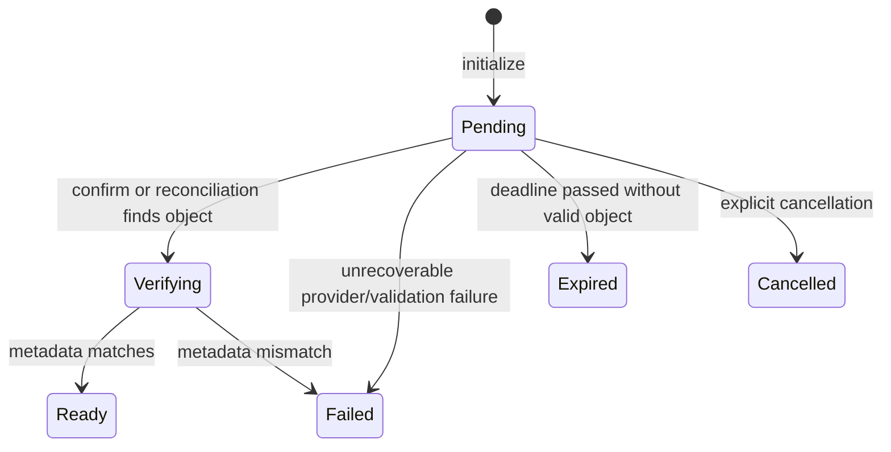

# Evidence file uploads

Status: Approved; implementation not started  
Last reviewed: 2026-07-11  
Owning module: Evidence  
Depends on: implemented storage profiles; Session eligibility contract; an explicit decision about authentication exposure

## Scope

Implement the missing file lifecycle for FileReference Evidence using the selected Local or Amazon S3 storage profile.

The increment includes:

- file-upload initialization
- server-controlled storage identity
- Local streaming upload and Amazon S3 direct upload
- provider-side verification and domain state transitions
- status/read metadata
- authorized download URL or stream
- expiration and interrupted-upload recovery
- cleanup behavior that does not extend request transactions across storage systems
- domain, application, infrastructure, and HTTP integration coverage

It does not include multipart uploads, antivirus/content scanning, media transformation, OCR, public sharing, storage-profile deletion, or a general background-processing platform unless required by the minimal recovery workflow.

## Existing foundation

The current code already contains:

- `EvidenceItem` support for attaching one `EvidenceFile`
- an `EvidenceFileUploadAttemptId`
- file metadata, checksum, storage-profile identity, object key, expiry, version, and failure fields
- `Pending`, `Verifying`, `Ready`, `Failed`, `Expired`, and `Cancelled` states
- domain transition methods and persistence mappings
- a 25 MiB file-size policy and allowed content types
- Local and Amazon S3 storage profiles
- profile verification, active-profile selection, and provider resolution

No HTTP endpoint currently initializes, transfers, confirms, reads, or downloads a file. Generic Evidence creation intentionally rejects `FileReference`.

## Confirmed decisions

### One atomic database reservation

Initialization creates the FileReference EvidenceItem and its pending EvidenceFile in one Evidence database transaction. The database reservation is committed before the client receives a usable upload instruction.

PostgreSQL and a filesystem/S3 cannot share a transaction. The workflow is a small stateful process with explicit recovery, not a distributed transaction.

### Server-controlled object identity

The server generates the storage profile ID, relative/object key, Evidence ID, and upload-attempt ID. Clients never supply a filesystem path or S3 object key.

Object keys must be opaque, unique, and scoped beneath the selected profile's configured root or prefix. Original filename is display metadata only.

### Provider abstraction

Add an Evidence Application abstraction implemented by Evidence Infrastructure. It should cover only required capabilities, for example:

- initialize or describe an upload target
- write/stream Local content where applicable
- read authoritative object metadata
- create a short-lived download instruction
- delete or quarantine an object for asynchronous cleanup

AWS SDK and filesystem implementation types must not appear in Domain or Application contracts.

### Provider-specific transfer

- **Local:** upload through the API as a bounded stream to a temporary file, verify metadata/checksum, then atomically move within the configured root.
- **Amazon S3:** return a short-lived presigned request and let the client upload directly. The API must not proxy S3 file bytes.

Do not buffer an entire file in memory.

### Verification is authoritative

A client confirmation is a request to verify, not proof that upload succeeded. The backend reads provider metadata and checks:

- expected storage identity
- size
- content type
- checksum when supplied/required
- S3 version ID when available
- attempt identity and expiry

Only backend verification can transition the file to Ready.

### Credentials and secrets

- Storage profiles contain non-secret provider configuration only.
- Local development should use the normal AWS profile/SSO credential chain.
- Deployed workloads should use temporary role credentials appropriate to their host.
- No endpoint accepts AWS access keys.
- Do not log presigned URLs, credentials, or sensitive response headers.

### Removal and physical cleanup

Evidence removal remains a database soft delete in the request transaction. Physical object cleanup happens separately and idempotently after the fact. Define retention policy before enabling deletion; do not synchronously delete storage content in the removal request.

## HTTP design

Final route naming should remain consistent with the existing Session Evidence surface. Proposed routes:

| Method | Route | Purpose |
| :--- | :--- | :--- |
| POST | `/lsessions/{sessionId}/evidence-items/file-uploads` | Create FileReference and pending upload |
| PUT/POST | `/lsessions/{sessionId}/evidence-items/{itemId}/file-upload/content` | Stream Local content only |
| POST | `/lsessions/{sessionId}/evidence-items/{itemId}/file-upload/confirm` | Verify provider state |
| GET | `/lsessions/{sessionId}/evidence-items/{itemId}/file-upload` | Read state and safe metadata |
| POST | `/lsessions/{sessionId}/evidence-items/{itemId}/file-upload/renew` | Create a new attempt after expiry, if renewal is approved |
| DELETE | `/lsessions/{sessionId}/evidence-items/{itemId}/file-upload` | Cancel a pending attempt |
| POST | `/lsessions/{sessionId}/evidence-items/{itemId}/file/download-url` | Authorize and issue download access |

Initialization input:

- owner identity until claim-based identity replaces it
- optional caption/description
- original filename
- content type
- size in bytes
- checksum algorithm and value according to the domain policy
- optional idempotency key

Initialization output:

- Evidence Item ID
- upload-attempt ID
- provider-neutral upload mode
- upload URL/method/required headers for S3, or Local content route
- expiration time
- current state

Never expose internal Local paths. Avoid exposing internal S3 keys unless a client protocol strictly requires them.

## State behavior

`Uploading` is not an authoritative backend state because the API cannot observe browser-to-S3 progress.

Retry rules:

- Repeating initialization with the same idempotency key returns the existing live reservation.
- Repeating confirmation is safe and returns current state.
- Duplicate S3 notifications or reconciliation attempts do not repeat terminal transitions.
- Renewal creates a new upload-attempt identity and storage key; it must not reuse an expired presigned target.

## Security requirements

Before production exposure:

- derive owner identity from authenticated claims
- enforce Session and Evidence ownership on every operation
- protect storage-profile administration with an admin policy
- restrict Local paths to configured roots and prevent traversal/symlink escape
- keep S3 buckets private with Block Public Access
- restrict the workload IAM role to the configured bucket/prefix and required actions
- use short-lived presigned requests with exact key, method, content type, and checksum constraints where supported
- configure exact browser CORS origins rather than wildcards
- encrypt stored content and define versioning/retention expectations
- validate filenames only as metadata and sanitize any download `Content-Disposition`

Untrusted file scanning is deferred, so deployment documentation must state that Ready means metadata-verified, not malware-safe.

## Recovery and background work

Add a bounded reconciliation job for Pending uploads past their deadline:

1. claim a batch safely
2. perform one final provider metadata check
3. mark a matching object Ready through normal verification transitions
4. otherwise mark the attempt Expired
5. emit metrics/logs without sensitive URLs

For Amazon S3, an object-created notification through SQS/EventBridge may later invoke the same idempotent verification service. The initial increment may rely on client confirmation plus reconciliation if that provides adequate recovery.

If multipart upload is added later, configure provider lifecycle cleanup for abandoned parts. Multipart behavior is not part of the current 25 MiB workflow.

## Implementation sequence

### 1. Resolve boundary decisions

- define `FileReference.Content` as caption/description or remove ambiguity from the contract
- decide whether claim-based authentication is part of this increment or a hard deployment prerequisite
- finalize allowed content types, checksum requirements, upload expiry, renewal, and retention
- decide the minimal Local HTTP upload shape

### 2. Application abstraction

- add provider-neutral storage operations in Evidence Application
- implement active-profile resolution for a new upload
- define safe metadata and provider error mapping
- keep AWS types out of the interface

### 3. Initialization

- validate Session eligibility and file policy
- generate identifiers and server-controlled key
- create FileReference plus pending EvidenceFile atomically
- make retries idempotent
- issue provider-specific upload instructions only after commit

### 4. Transfer and confirmation

- implement bounded Local streaming with temporary-file cleanup
- implement S3 presigning through the selected profile
- verify authoritative provider metadata
- drive existing domain transitions and persist version/failure data

### 5. Read and download

- extend Evidence read models with safe file metadata and status
- add status polling only if the general Evidence representation is insufficient
- allow download only for Ready files
- authorize each download and use short-lived access

### 6. Recovery and cleanup

- expire abandoned attempts through a scheduled job
- reconcile an object uploaded before a client disconnect
- define idempotent physical cleanup after Evidence removal
- add operational logs and metrics for pending age, failure, expiry, and verification latency

### 7. Testing and documentation

- domain tests for every legal and illegal transition
- application tests with a fake provider abstraction
- Local infrastructure tests using test-owned temporary roots
- S3 infrastructure tests against a controlled emulator or isolated test bucket where appropriate
- HTTP integration tests for initialization, ownership, Local transfer, confirmation, retry, expiry, and download
- controlled S3 outcomes in the ordinary integration suite; no real AWS calls
- update Product, Architecture, Domain model, API reference, executable requests, and integration-test documentation

## Completion conditions

The plan is complete when:

- a client can create, upload, verify, inspect, and download FileReference Evidence through Local storage
- the same public lifecycle works through Amazon S3 direct upload without storing credentials
- interrupted uploads expire or reconcile deterministically
- retries and duplicate processing are idempotent
- ownership and administrative boundaries are enforced or the feature remains explicitly non-production with a documented blocker
- no path traversal, arbitrary object key, or persistent test-directory escape is possible
- the full integration suite passes without contacting real Amazon S3
- all current behavior is migrated to maintained reference documentation and this plan is removed

## Deferred follow-up

- multipart upload
- file replacement/version history UX
- malware scanning and quarantine release
- thumbnails, OCR, and previews
- public sharing
- continuous provider health checks
- storage migration between profiles
- profile deletion
